[TOC]

## 1333203 DSA Summer 2024

### Question 1(a): Define linear data structure and give its examples. (03 marks)

**Ans 1(a):**
A linear data structure is a type of data organization where elements are arranged in a sequential manner, with each element directly linked to its adjacent elements. Key characteristics of linear data structures include:

- Elements are organized in a linear or sequential order.
- Each element has a unique predecessor and successor, except for the first and last elements.
- Data can be traversed in a single run, i.e., in one pass.

Examples of linear data structures:

1. **Array**: A collection of elements stored in contiguous memory locations.
2. **Linked List**: A sequence of nodes where each node contains data and a reference to the next node.
3. **Stack**: Follows Last-In-First-Out (LIFO) principle for element access.
4. **Queue**: Follows First-In-First-Out (FIFO) principle for element access.

```mermaid
graph TD
    subgraph Array
    A[0] --> |10| B[1]
    B --> |20| C[2]
    C --> |30| D[3]
    D --> |40| E[4]
    end

    subgraph "Linked List"
    F["10 | ->"] --> G["20 | ->"]
    G --> H["30 | ->"]
    H --> I["40 | null"]
    end

    subgraph Stack
    J[Top] --> |40| K
    K --> |30| L
    L --> |20| M
    M --> |10| N[Bottom]
    end

    subgraph Queue
    O[Front] --> |10| P
    P --> |20| Q
    Q --> |30| R
    R --> |40| S[Rear]
    end
```

### પ્રશ્ન 1(અ): રેખીય ડેટા સ્ટ્રક્ચર વ્યાખ્યાયિત કરો અને તેના ઉદાહરણો આપો. (૦૩)

**જવાબ 1(અ):**
રેખીય ડેટા સ્ટ્રક્ચર એ ડેટા સંગઠનનો એક પ્રકાર છે જ્યાં elements ક્રમિક રીતે ગોઠવાયેલા હોય છે, જેમાં દરેક element તેના આજુબાજુના elements સાથે સીધી રીતે જોડાયેલો હોય છે. રેખીય ડેટા સ્ટ્રક્ચરની મુખ્ય લાક્ષણિકતાઓમાં સામેલ છે:

- Elements રેખીય અથવા ક્રમિક ક્રમમાં ગોઠવાયેલા હોય છે.
- દરેક element ને અનન્ય પૂર્વગામી અને અનુગામી હોય છે, સિવાય કે પ્રથમ અને છેલ્લા elements.
- ડેટાને એક જ run માં, એટલે કે એક પાસમાં traverse કરી શકાય છે.

રેખીય ડેટા સ્ટ્રક્ચરના ઉદાહરણો:

1. **Array**: સળંગ મેમરી સ્થાનોમાં સંગ્રહિત elements નો સમૂહ.
2. **Linked List**: nodes નો ક્રમ જ્યાં દરેક node માં ડેટા અને આગળના node નો સંદર્ભ હોય છે.
3. **Stack**: Element access માટે Last-In-First-Out (LIFO) સિદ્ધાંતને અનુસરે છે.
4. **Queue**: Element access માટે First-In-First-Out (FIFO) સિદ્ધાંતને અનુસરે છે.


### Question 1(b): Define time and space complexity. (04 marks)

**Ans 1(b):**
Time and space complexity are crucial concepts in algorithm analysis that help evaluate the efficiency and resource requirements of an algorithm.

**Time Complexity:**
Time complexity is a measure of the amount of time an algorithm takes to complete as a function of the input size. It represents the number of operations or steps an algorithm performs relative to the input size.

Key points about time complexity:
- Expressed using Big O notation, e.g., O(n), O(log n), O(n^2)
- Focuses on the worst-case scenario
- Helps compare the efficiency of different algorithms
- Independent of hardware or implementation details

Example: An algorithm with O(n) time complexity means its execution time grows linearly with the input size.

**Space Complexity:**
Space complexity refers to the amount of memory space an algorithm requires relative to the input size. It measures how much additional or auxiliary space is needed by the algorithm to solve a problem.

Key points about space complexity:
- Also expressed using Big O notation
- Includes both auxiliary space and space used by the input
- Helps evaluate memory efficiency of algorithms
- Important for applications with limited memory resources

Example: An algorithm with O(1) space complexity uses a constant amount of extra space regardless of input size.

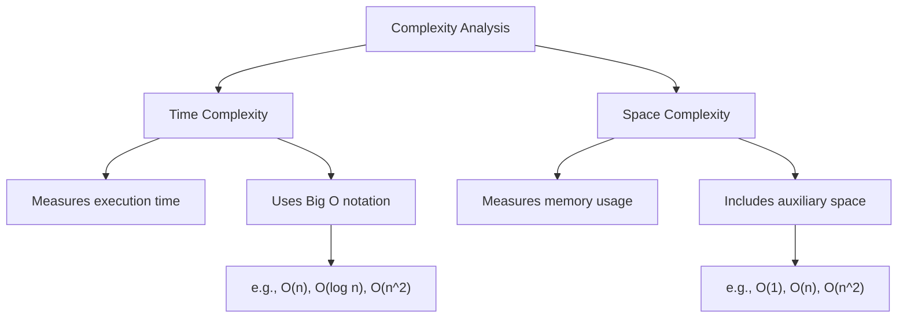

### પ્રશ્ન 1(બ): ટાઇમ અને સ્પેસ કોમ્પ્લેક્ષીટી વ્યાખ્યાયિત કરો. (૦૪)

**જવાબ 1(બ):**
ટાઇમ અને સ્પેસ કોમ્પ્લેક્ષીટી એ અલ્ગોરિધમ વિશ્લેષણમાં મહત્વપૂર્ણ ખ્યાલો છે જે અલ્ગોરિધમની કાર્યક્ષમતા અને સંસાધન જરૂરિયાતોનું મૂલ્યાંકન કરવામાં મદદ કરે છે.

**ટાઇમ કોમ્પ્લેક્ષીટી:**
ટાઇમ કોમ્પ્લેક્ષીટી એ ઇનપુટ સાઇઝના ફંક્શન તરીકે અલ્ગોરિધમ પૂર્ણ થવામાં લાગતા સમયનું માપ છે. તે ઇનપુટ સાઇઝના સંબંધમાં અલ્ગોરિધમ દ્વારા કરવામાં આવતા operations અથવા steps ની સંખ્યાને રજૂ કરે છે.

ટાઇમ કોમ્પ્લેક્ષીટી વિશેના મુખ્ય મુદ્દાઓ:
- Big O notation નો ઉપયોગ કરીને વ્યક્ત કરવામાં આવે છે, દા.ત., O(n), O(log n), O(n^2)
- સૌથી ખરાબ કેસ સ્થિતિ પર ધ્યાન કેન્દ્રિત કરે છે
- વિવિધ અલ્ગોરિધમ્સની કાર્યક્ષમતાની તુલના કરવામાં મદદ કરે છે
- હાર્ડવેર અથવા અમલીકરણની વિગતોથી સ્વતંત્ર

ઉદાહરણ: O(n) ટાઇમ કોમ્પ્લેક્ષીટી ધરાવતા અલ્ગોરિધમનો અર્થ એ છે કે તેનો execution સમય ઇનપુટ સાઇઝ સાથે રૈખિક રીતે વધે છે.

**સ્પેસ કોમ્પ્લેક્ષીટી:**
સ્પેસ કોમ્પ્લેક્ષીટી એ ઇનપુટ સાઇઝના સંબંધમાં અલ્ગોરિધમને જરૂરી મેમરી સ્પેસની રકમનો ઉલ્લેખ કરે છે. તે સમસ્યાનો ઉકેલ લાવવા માટે અલ્ગોરિધમને જરૂરી વધારાની અથવા સહાયક જગ્યાનું માપ કરે છે.

સ્પેસ કોમ્પ્લેક્ષીટી વિશેના મુખ્ય મુદ્દાઓ:
- પણ Big O notation નો ઉપયોગ કરીને વ્યક્ત કરવામાં આવે છે
- સહાયક સ્પેસ અને ઇનપુટ દ્વારા વપરાયેલ સ્પેસ બંને સામેલ છે
- અલ્ગોરિધમ્સની મેમરી કાર્યક્ષમતાનું મૂલ્યાંકન કરવામાં મદદ કરે છે
- મર્યાદિત મેમરી સંસાધનો ધરાવતા એપ્લિકેશનો માટે મહત્વપૂર્ણ

ઉદાહરણ: O(1) સ્પેસ કોમ્પ્લેક્ષીટી ધરાવતો અલ્ગોરિધમ ઇનપુટ સાઇઝને ધ્યાનમાં લીધા વિના સતત પ્રમાણમાં વધારાની જગ્યાનો ઉપયોગ કરે છે.

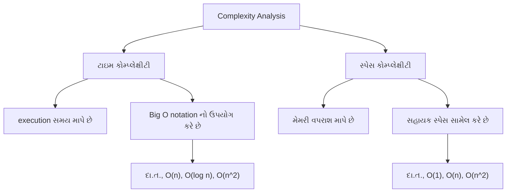

### Question 1(c): Explain the concept of class and object with example. (07 marks)

**Ans 1(c):**
Classes and objects are fundamental concepts in object-oriented programming (OOP). They provide a way to structure code, encapsulate data, and create reusable components.

**Class:**
A class is a blueprint or template for creating objects. It defines the attributes (data) and methods (functions) that the objects of that class will have.

Key points about classes:
- Act as a blueprint for objects
- Encapsulate data and behavior
- Support inheritance and polymorphism
- Promote code reusability and organization

**Object:**
An object is an instance of a class. It represents a specific entity with its own set of data and ability to perform actions defined by its class.

Key points about objects:
- Instances of a class
- Have their own unique set of attributes
- Can perform actions (methods) defined in their class
- Interact with other objects

**Example: Car Class and Objects**

Let's illustrate these concepts with a `Car` class and car objects:

```python
class Car:
    def __init__(self, make, model, year, color):
        self.make = make
        self.model = model
        self.year = year
        self.color = color
        self.speed = 0

    def accelerate(self, increase):
        self.speed += increase
        print(f"{self.make} {self.model} is now going {self.speed} km/h")

    def brake(self, decrease):
        if self.speed - decrease < 0:
            self.speed = 0
        else:
            self.speed -= decrease
        print(f"{self.make} {self.model} slowed down to {self.speed} km/h")

# Creating car objects
car1 = Car("Toyota", "Corolla", 2022, "Blue")
car2 = Car("Honda", "Civic", 2023, "Red")

# Using object methods
car1.accelerate(50)
car2.accelerate(60)
car1.brake(20)
car2.brake(30)
```

In this example:
1. The `Car` class defines the blueprint for car objects.
2. It has attributes like `make`, `model`, `year`, `color`, and `speed`.
3. It also has methods `accelerate()` and `brake()` to modify the car's speed.
4. We create two car objects, `car1` and `car2`, each with its own set of attributes.
5. We can call methods on these objects to change their state.

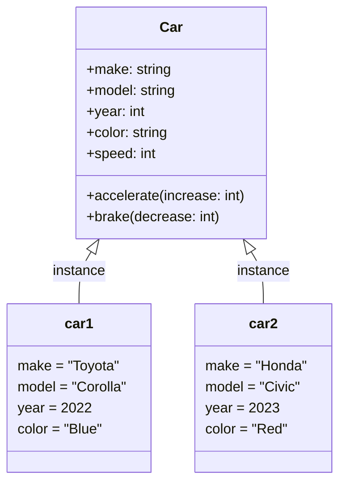

This diagram illustrates the relationship between the `Car` class and its objects, showing how each object is an instance of the class with its own unique set of attributes.

### પ્રશ્ન 1(ક): ક્લાસ અને ઓબ્જેક્ટ ઉદાહરણ સાથે સમજાવો. (૦૭)

**જવાબ 1(ક):**
Class અને object એ object-oriented programming (OOP)માં મૂળભૂત concepts છે. તેઓ કોડને structure કરવા, data ને encapsulate કરવા અને reusable components બનાવવાની રીત પ્રદાન કરે છે.

**Class:**
Class એ objects બનાવવા માટેનો blueprint અથવા template છે. તે attributes (data) અને methods (functions) ને વ્યાખ્યાયિત કરે છે જે તે class ના objects ધરાવશે.

Class વિશેના મુખ્ય મુદ્દાઓ:
- Objects માટે blueprint તરીકે કાર્ય કરે છે
- Data અને behavior ને encapsulate કરે છે
- Inheritance અને polymorphism ને support કરે છે
- Code reusability અને organization ને પ્રોત્સાહન આપે છે

**Object:**
Object એ class નું instance છે. તે ચોક્કસ entity નું પ્રતિનિધિત્વ કરે છે જે તેના પોતાના data set અને તેના class દ્વારા વ્યાખ્યાયિત ક્રિયાઓ કરવાની ક્ષમતા ધરાવે છે.

Objects વિશેના મુખ્ય મુદ્દાઓ:
- Class ના instances છે
- તેમના પોતાના અનન્ય attributes set ધરાવે છે
- તેમના class માં વ્યાખ્યાયિત ક્રિયાઓ (methods) કરી શકે છે
- અન્ય objects સાથે interact કરે છે

**ઉદાહરણ: Car Class અને Objects**

આ concepts ને `Car` class અને car objects સાથે સમજાવીએ:

```python
class Car:
    def __init__(self, make, model, year, color):
        self.make = make
        self.model = model
        self.year = year
        self.color = color
        self.speed = 0

    def accelerate(self, increase):
        self.speed += increase
        print(f"{self.make} {self.model} હવે {self.speed} km/h પર જઈ રહ્યું છે")

    def brake(self, decrease):
        if self.speed - decrease < 0:
            self.speed = 0
        else:
            self.speed -= decrease
        print(f"{self.make} {self.model} ધીમું પડીને {self.speed} km/h પર આવ્યું")

# Car objects બનાવવા
car1 = Car("Toyota", "Corolla", 2022, "Blue")
car2 = Car("Honda", "Civic", 2023, "Red")

# Object methods નો ઉપયોગ કરવો
car1.accelerate(50)
car2.accelerate(60)
car1.brake(20)
car2.brake(30)
```

આ ઉદાહરણમાં:
1. `Car` class car objects માટે blueprint વ્યાખ્યાયિત કરે છે.
2. તેમાં `make`, `model`, `year`, `color`, અને `speed` જેવા attributes છે.
3. તેમાં `accelerate()` અને `brake()` methods પણ છે જે car ની speed ને modify કરે છે.
4. આપણે બે car objects બનાવીએ છીએ, `car1` અને `car2`, દરેક તેના પોતાના attributes set સાથે.
5. આપણે આ objects પર methods ને call કરી શકીએ છીએ જેથી તેમની state બદલાય.


આ આકૃતિ `Car` class અને તેના objects વચ્ચેના સંબંધને દર્શાવે છે, જે બતાવે છે કે કેવી રીતે દરેક object એ class નું instance છે જે તેના પોતાના અનન્ય attributes set ધરાવે છે.

### Question 1(cOR): Explain instance method, class method and static method with example. (07 marks)

**Ans 1(cOR):**
In object-oriented programming, particularly in Python, there are three types of methods: instance methods, class methods, and static methods. Each serves a different purpose and has unique characteristics.

1. **Instance Methods:**
   - Operate on instance-specific data
   - First parameter is `self` (the instance)
   - Can access and modify instance state

2. **Class Methods:**
   - Operate on class-level data
   - First parameter is `cls` (the class)
   - Decorated with `@classmethod`
   - Can access and modify class state

3. **Static Methods:**
   - Don't operate on instance or class data
   - No special first parameter
   - Decorated with `@staticmethod`
   - Utility functions related to the class

Example demonstrating all three types:

```python
class MathOperations:
    pi = 3.14159  # Class variable

    def __init__(self, value):
        self.value = value  # Instance variable

    def square(self):  # Instance method
        return self.value ** 2

    @classmethod
    def circle_area(cls, radius):  # Class method
        return cls.pi * radius ** 2

    @staticmethod
    def add(a, b):  # Static method
        return a + b

# Usage
math_obj = MathOperations(5)
print(math_obj.square())  # Instance method call
print(MathOperations.circle_area(3))  # Class method call
print(MathOperations.add(10, 20))  # Static method call
```

Comparison in tabular form:

| Aspect                    | Instance Method              | Class Method           | Static Method     |
| ------------------------- | ---------------------------- | ---------------------- | ----------------- |
| Decorator                 | None                         | `@classmethod`         | `@staticmethod`   |
| First Parameter           | `self` (instance)            | `cls` (class)          | None              |
| Can Access Instance State | Yes                          | No                     | No                |
| Can Access Class State    | Yes                          | Yes                    | No                |
| Can Modify Class State    | No                           | Yes                    | No                |
| Called via                | Instance                     | Class or Instance      | Class or Instance |
| Use Case                  | Instance-specific operations | Class-level operations | Utility functions |

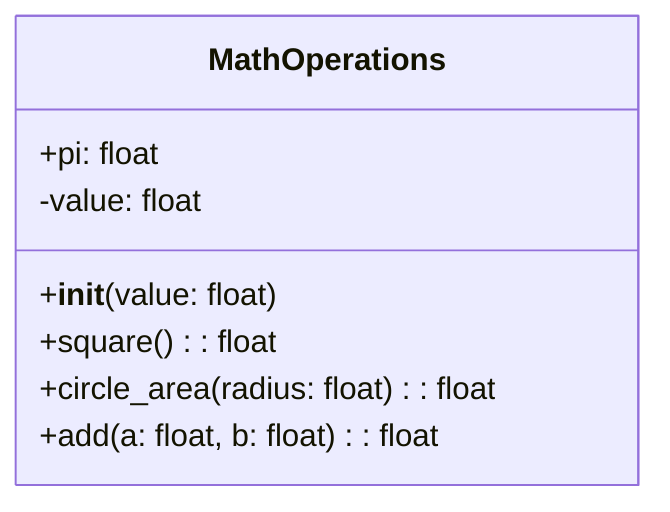

This diagram illustrates the structure of the `MathOperations` class, showing the different types of methods and their parameters.

### પ્રશ્ન 1(કOR): ઇંસ્ટંસ મેથડ, ક્લાસ મેથડ અને સ્ટેટીક મેથડ ઉદાહરણ સાથે સમજાવો. (૦૭)

**જવાબ 1(કOR):**
Object-oriented programming માં, ખાસ કરીને Python માં, ત્રણ પ્રકારની methods હોય છે: instance methods, class methods, અને static methods. દરેક અલગ હેતુ માટે સેવા આપે છે અને અનન્ય લક્ષણો ધરાવે છે.

1. **Instance Methods:**
   - Instance-specific data પર કાર્ય કરે છે
   - પ્રથમ parameter `self` (instance) છે
   - Instance state ને access અને modify કરી શકે છે

2. **Class Methods:**
   - Class-level data પર કાર્ય કરે છે
   - પ્રથમ parameter `cls` (class) છે
   - `@classmethod` decorator સાથે ડેકોરેટ કરેલ હોય છે
   - Class state ને access અને modify કરી શકે છે

3. **Static Methods:**
   - Instance કે class data પર કાર્ય કરતી નથી
   - કોઈ ખાસ પ્રથમ parameter નથી
   - `@staticmethod` decorator સાથે ડેકોરેટ કરેલ હોય છે
   - Class સાથે સંબંધિત utility functions છે

ત્રણેય પ્રકારને દર્શાવતું ઉદાહરણ:

```python
class MathOperations:
    pi = 3.14159  # Class variable

    def __init__(self, value):
        self.value = value  # Instance variable

    def square(self):  # Instance method
        return self.value ** 2

    @classmethod
    def circle_area(cls, radius):  # Class method
        return cls.pi * radius ** 2

    @staticmethod
    def add(a, b):  # Static method
        return a + b

# ઉપયોગ
math_obj = MathOperations(5)
print(math_obj.square())  # Instance method call
print(MathOperations.circle_area(3))  # Class method call
print(MathOperations.add(10, 20))  # Static method call
```

કોષ્ટક સ્વરૂપમાં તુલના:

| પાસું                          | Instance Method              | Class Method           | Static Method       |
| ---------------------------- | ---------------------------- | ---------------------- | ------------------- |
| Decorator                    | કોઈ નહીં                      | `@classmethod`         | `@staticmethod`     |
| પ્રથમ Parameter               | `self` (instance)            | `cls` (class)          | કોઈ નહીં             |
| Instance State Access કરી શકે | હા                           | ના                     | ના                  |
| Class State Access કરી શકે    | હા                           | હા                     | ના                  |
| Class State Modify કરી શકે    | ના                           | હા                     | ના                  |
| દ્વારા Call થાય               | Instance                     | Class અથવા Instance    | Class અથવા Instance |
| ઉપયોગ કેસ                     | Instance-specific operations | Class-level operations | Utility functions   |


આ આકૃતિ `MathOperations` class ની રચનાને દર્શાવે છે, જે વિવિધ પ્રકારની methods અને તેમના parameters બતાવે છે.

### Question 2(a): Explain concept of recursive function. (03 marks)

**Ans 2(a):**
A recursive function is a function that calls itself during its execution. This technique allows the function to repeat its behavior until it reaches a specific condition, known as the base case, which terminates the recursion.

Key points about recursive functions:

1. **Base Case:** 
   - A condition that stops the recursion
   - Prevents infinite recursion
   - Usually the simplest form of the problem

2. **Recursive Case:**
   - The part where the function calls itself
   - Breaks down the problem into smaller subproblems

3. **Call Stack:**
   - Each recursive call adds a new layer to the call stack
   - The stack unwinds as base cases are reached and functions return

4. **Advantages:**
   - Can solve complex problems with elegant and concise code
   - Naturally suited for problems with recursive structures (e.g., tree traversal)

5. **Disadvantages:**
   - Can be memory-intensive for deep recursions
   - May be less efficient than iterative solutions for simple problems

Example of a recursive function to calculate factorial:

```python
def factorial(n):
    # Base case
    if n == 0 or n == 1:
        return 1
    # Recursive case
    else:
        return n * factorial(n - 1)

# Usage
print(factorial(5))  # Output: 120
```

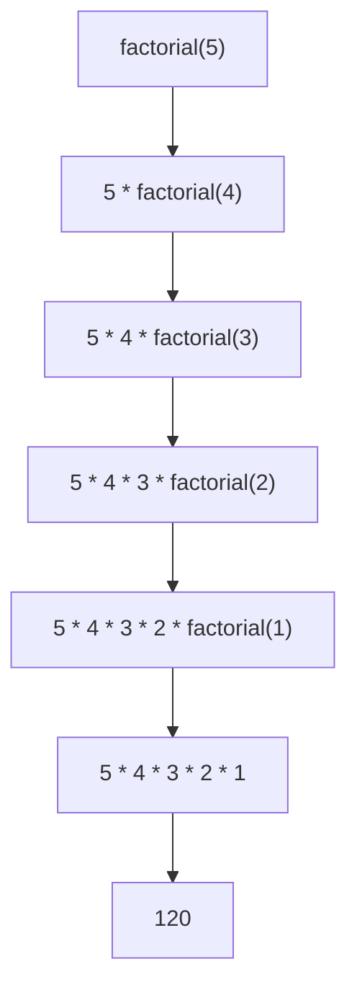

This diagram illustrates how the recursive function breaks down the factorial calculation into smaller subproblems until it reaches the base case.

### પ્રશ્ન 2(અ): રીકર્ઝીવ ફંકશન નો કોંસેપ્ટ સમજાવો. (૦૩)

**જવાબ 2(અ):**
રીકર્ઝીવ ફંક્શન એ એવું ફંક્શન છે જે તેના execution દરમિયાન પોતાને જ કૉલ કરે છે. આ તકનીક ફંક્શનને તેની વર્તણૂકને પુનરાવર્તિત કરવાની મંજૂરી આપે છે જ્યાં સુધી તે ચોક્કસ શરત, જેને base case કહેવામાં આવે છે, સુધી ન પહોંચે, જે રીકર્શનને સમાપ્ત કરે છે.

રીકર્ઝીવ ફંક્શન્સ વિશેના મુખ્ય મુદ્દાઓ:

1. **Base Case:**
   - એક શરત જે રીકર્શનને રોકે છે
   - અનંત રીકર્શનને અટકાવે છે
   - સામાન્ય રીતે સમસ્યાનું સૌથી સરળ સ્વરૂપ

2. **Recursive Case:**
   - તે ભાગ જ્યાં ફંક્શન પોતાને કૉલ કરે છે
   - સમસ્યાને નાના ઉપ-સમસ્યાઓમાં વિભાજિત કરે છે

3. **Call Stack:**
   - દરેક રીકર્ઝીવ કૉલ call stack માં નવું સ્તર ઉમેરે છે
   - જ્યારે base cases સુધી પહોંચે અને ફંક્શન્સ પરત થાય ત્યારે stack unwind થાય છે

4. **ફાયદાઓ:**
   - જટિલ સમસ્યાઓને elegant અને સંક્ષિપ્ત કોડ સાથે ઉકેલી શકે છે
   - રીકર્ઝીવ સ્ટ્રક્ચર્સ (દા.ત., tree traversal) વાળી સમસ્યાઓ માટે કુદરતી રીતે અનુકૂળ

5. **ગેરફાયદાઓ:**
   - ઊંડા રીકર્શન માટે મેમરી-ઇન્ટેન્સિવ હોઈ શકે છે
   - સરળ સમસ્યાઓ માટે iterative solutions કરતાં ઓછું કાર્યક્ષમ હોઈ શકે છે

Factorial ગણવા માટે રીકર્ઝીવ ફંક્શનનું ઉદાહરણ:

```python
def factorial(n):
    # Base case
    if n == 0 or n == 1:
        return 1
    # Recursive case
    else:
        return n * factorial(n - 1)

# ઉપયોગ
print(factorial(5))  # આઉટપુટ: 120
```


આ આકૃતિ દર્શાવે છે કે કેવી રીતે રીકર્ઝીવ ફંક્શન factorial ગણતરીને નાના ઉપ-સમસ્યાઓમાં વિભાજિત કરે છે જ્યાં સુધી તે base case સુધી ન પહોંચે.

### Question 2(b): Define stack and queue. (04 marks)

**Ans 2(b):**

**Stack:**
A stack is a linear data structure that follows the Last-In-First-Out (LIFO) principle. It can be visualized as a stack of plates where you can only add or remove plates from the top.

Key characteristics of a stack:
1. Elements are added to the top (push operation)
2. Elements are removed from the top (pop operation)
3. Only the top element is accessible at any time
4. Follows the LIFO (Last-In-First-Out) principle

Common operations:
- Push: Add an element to the top
- Pop: Remove the top element
- Peek or Top: View the top element without removing it
- IsEmpty: Check if the stack is empty

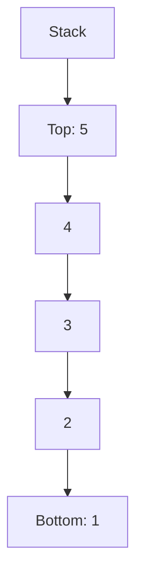

**Queue:**
A queue is a linear data structure that follows the First-In-First-Out (FIFO) principle. It can be visualized as a line of people waiting for a service, where the first person to join the line is the first to be served.

Key characteristics of a queue:
1. Elements are added at the rear (enqueue operation)
2. Elements are removed from the front (dequeue operation)
3. Follows the FIFO (First-In-First-Out) principle

Common operations:
- Enqueue: Add an element to the rear
- Dequeue: Remove the front element
- Front: View the front element without removing it
- IsEmpty: Check if the queue is empty

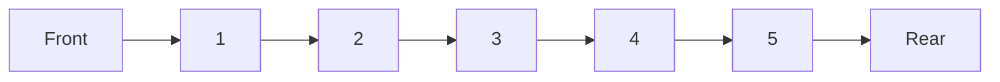

Both stacks and queues are fundamental data structures used in various algorithms and system designs, each suited for different types of problems based on their access patterns.

### પ્રશ્ન 2(બ): સ્ટેક અને ક્યુ વ્યાખ્યાયિત કરો. (૦૪)

**જવાબ 2(બ):**

**સ્ટેક:**
સ્ટેક એ એક linear data structure છે જે Last-In-First-Out (LIFO) સિદ્ધાંતને અનુસરે છે. તેને પ્લેટ્સના સ્ટેક તરીકે કલ્પના કરી શકાય છે જ્યાં તમે માત્ર ટોચથી જ પ્લેટ્સ ઉમેરી અથવા દૂર કરી શકો છો.

સ્ટેકની મુખ્ય લાક્ષણિકતાઓ:
1. Elements ને ટોચ પર ઉમેરવામાં આવે છે (push operation)
2. Elements ને ટોચથી દૂર કરવામાં આવે છે (pop operation)
3. કોઈપણ સમયે માત્ર ટોચનો element જ accessible હોય છે
4. LIFO (Last-In-First-Out) સિદ્ધાંતને અનુસરે છે

સામાન્ય operations:
- Push: ટોચ પર element ઉમેરવો
- Pop: ટોચનો element દૂર કરવો
- Peek અથવા Top: ટોચનો element દૂર કર્યા વગર જોવો
- IsEmpty: સ્ટેક ખાલી છે કે નહીં તે ચકાસવું

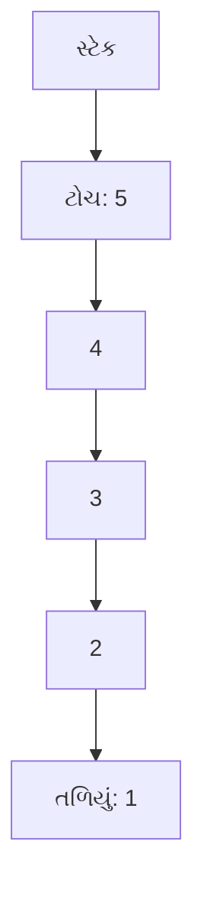

**ક્યુ:**
ક્યુ એ એક linear data structure છે જે First-In-First-Out (FIFO) સિદ્ધાંતને અનુસરે છે. તેને સેવા માટે રાહ જોતા લોકોની લાઇન તરીકે કલ્પના કરી શકાય છે, જ્યાં લાઇનમાં જોડાનાર પ્રથમ વ્યક્તિને પ્રથમ સેવા આપવામાં આવે છે.

ક્યુની મુખ્ય લાક્ષણિકતાઓ:
1. Elements ને પાછળના ભાગમાં ઉમેરવામાં આવે છે (enqueue operation)
2. Elements ને આગળના ભાગથી દૂર કરવામાં આવે છે (dequeue operation)
3. FIFO (First-In-First-Out) સિદ્ધાંતને અનુસરે છે

સામાન્ય operations:
- Enqueue: પાછળના ભાગમાં element ઉમેરવો
- Dequeue: આગળના ભાગનો element દૂર કરવો
- Front: આગળના ભાગનો element દૂર કર્યા વગર જોવો
- IsEmpty: ક્યુ ખાલી છે કે નહીં તે ચકાસવું

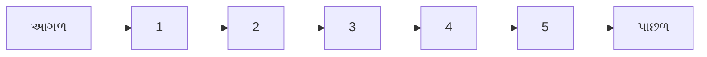

સ્ટેક અને ક્યુ બંને વિવિધ algorithms અને system designs માં ઉપયોગમાં લેવાતા મૂળભૂત data structures છે, જે તેમના access patterns ના આધારે અલગ-અલગ પ્રકારની સમસ્યાઓ માટે યોગ્ય છે.

### Question 2(c): Explain basic operations on stack. (07 marks)

**Ans 2(c):**
A stack is a fundamental data structure that follows the Last-In-First-Out (LIFO) principle. The basic operations on a stack include Push, Pop, Peek (or Top), IsEmpty, and IsFull. Let's explain each of these operations in detail:

1. **Push Operation:**
   - Adds an element to the top of the stack
   - Increases the stack size by 1
   - If the stack is full, it results in a stack overflow condition

   ```python
   def push(stack, item):
       if len(stack) < MAX_SIZE:
           stack.append(item)
       else:
           print("Stack Overflow")
   ```

2. **Pop Operation:**
   - Removes the top element from the stack
   - Decreases the stack size by 1
   - If the stack is empty, it results in a stack underflow condition

   ```python
   def pop(stack):
       if not is_empty(stack):
           return stack.pop()
       else:
           print("Stack Underflow")
           return None
   ```

3. **Peek (or Top) Operation:**
   - Returns the top element of the stack without removing it
   - Does not modify the stack

   ```python
   def peek(stack):
       if not is_empty(stack):
           return stack[-1]
       else:
           print("Stack is empty")
           return None
   ```

4. **IsEmpty Operation:**
   - Checks if the stack is empty
   - Returns True if the stack has no elements, False otherwise

   ```python
   def is_empty(stack):
       return len(stack) == 0
   ```

5. **IsFull Operation:**
   - Checks if the stack is full (applicable for fixed-size stacks)
   - Returns True if the stack has reached its maximum capacity, False otherwise

   ```python
   def is_full(stack):
       return len(stack) == MAX_SIZE
   ```

Example usage of these operations:

```python
MAX_SIZE = 5
stack = []

push(stack, 1)
push(stack, 2)
push(stack, 3)

print("Top element:", peek(stack))  # Output: 3
print("Popped element:", pop(stack))  # Output: 3
print("Is stack empty?", is_empty(stack))  # Output: False
print("Is stack full?", is_full(stack))  # Output: False
```

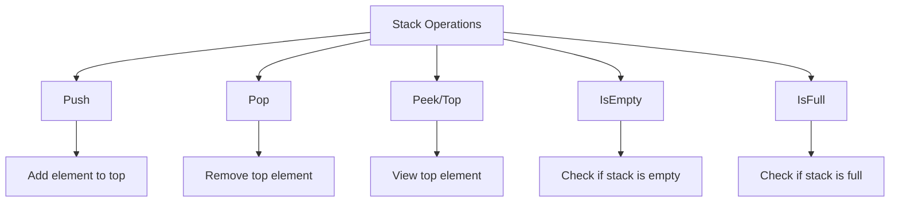

This diagram illustrates the basic operations on a stack and their primary functions.

### પ્રશ્ન 2(ક): સ્ટેક ના બેઝિક ઓપરેશન સમજાવો. (૦૭)

**જવાબ 2(ક):**
સ્ટેક એ મૂળભૂત ડેટા સ્ટ્રક્ચર છે જે Last-In-First-Out (LIFO) સિદ્ધાંતને અનુસરે છે. સ્ટેક પરના મૂળભૂત ઓપરેશન્સમાં Push, Pop, Peek (અથવા Top), IsEmpty, અને IsFull નો સમાવેશ થાય છે. આ દરેક ઓપરેશન્સને વિગતવાર સમજાવીએ:

1. **Push ઓપરેશન:**
   - સ્ટેકની ટોચ પર એક element ઉમેરે છે
   - સ્ટેકનું કદ 1 વધારે છે
   - જો સ્ટેક ભરેલો હોય, તો તે stack overflow સ્થિતિમાં પરિણમે છે

   ```python
   def push(stack, item):
       if len(stack) < MAX_SIZE:
           stack.append(item)
       else:
           print("સ્ટેક ઓવરફ્લો")
   ```

2. **Pop ઓપરેશન:**
   - સ્ટેકમાંથી ટોચનો element દૂર કરે છે
   - સ્ટેકનું કદ 1 ઘટાડે છે
   - જો સ્ટેક ખાલી હોય, તો તે stack underflow સ્થિતિમાં પરિણમે છે

   ```python
   def pop(stack):
       if not is_empty(stack):
           return stack.pop()
       else:
           print("સ્ટેક અંડરફ્લો")
           return None
   ```

3. **Peek (અથવા Top) ઓપરેશન:**
   - સ્ટેકના ટોચના element ને દૂર કર્યા વગર પરત કરે છે
   - સ્ટેકમાં કોઈ ફેરફાર કરતું નથી

   ```python
   def peek(stack):
       if not is_empty(stack):
           return stack[-1]
       else:
           print("સ્ટેક ખાલી છે")
           return None
   ```

4. **IsEmpty ઓપરેશન:**
   - સ્ટેક ખાલી છે કે નહીં તે ચકાસે છે
   - જો સ્ટેકમાં કોઈ elements ન હોય તો True, અન્યથા False પરત કરે છે

   ```python
   def is_empty(stack):
       return len(stack) == 0
   ```

5. **IsFull ઓપરેશન:**
   - સ્ટેક ભરેલો છે કે નહીં તે ચકાસે છે (નિશ્ચિત-કદના સ્ટેક્સ માટે લાગુ)
   - જો સ્ટેક તેની મહત્તમ ક્ષમતા સુધી પહોંચ્યો હોય તો True, અન્યથા False પરત કરે છે

   ```python
   def is_full(stack):
       return len(stack) == MAX_SIZE
   ```

આ ઓપરેશન્સનો ઉપયોગનું ઉદાહરણ:

```python
MAX_SIZE = 5
stack = []

push(stack, 1)
push(stack, 2)
push(stack, 3)

print("ટોચનો element:", peek(stack))  # આઉટપુટ: 3
print("દૂર કરેલ element:", pop(stack))  # આઉટપુટ: 3
print("શું સ્ટેક ખાલી છે?", is_empty(stack))  # આઉટપુટ: False
print("શું સ્ટેક ભરેલો છે?", is_full(stack))  # આઉટપુટ: False
```

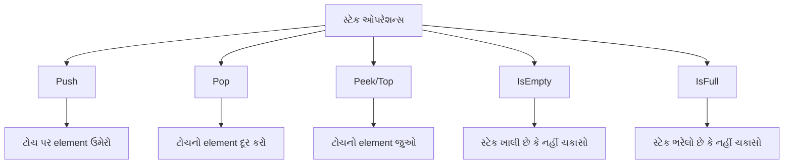

આ આકૃતિ સ્ટેક પરના મૂળભૂત ઓપરેશન્સ અને તેમના મુખ્ય કાર્યોને દર્શાવે છે.

### Question 2(aOR): Define singly linked list. (03 marks)

**Ans 2(aOR):**
A singly linked list is a linear data structure in which elements are stored in nodes. Each node contains two components:

1. Data: The actual value or information stored in the node.
2. Next pointer: A reference to the next node in the sequence.

Key characteristics of a singly linked list:

- Each node points only to the next node in the sequence.
- The last node points to NULL, indicating the end of the list.
- The first node is called the head of the list.
- Elements are not stored in contiguous memory locations.
- Dynamic size, allowing for efficient insertion and deletion operations.

Basic structure of a node in a singly linked list:

```python
class Node:
    def __init__(self, data):
        self.data = data
        self.next = None
```

Diagrammatic representation:

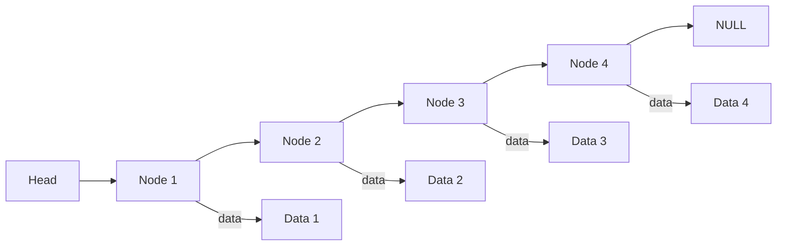

This diagram shows a singly linked list with four nodes, where each node points to the next one, and the last node points to NULL.

### પ્રશ્ન 2(અOR): સિંગ્લી લિંક્ડ લિસ્ટ વ્યાખ્યાયિત કરો. (૦૩)

**જવાબ 2(અOR):**
સિંગ્લી લિંક્ડ લિસ્ટ એ એક linear data structure છે જેમાં elements ને nodes માં સંગ્રહિત કરવામાં આવે છે. દરેક node બે ઘટકો ધરાવે છે:

1. Data: Node માં સંગ્રહિત વાસ્તવિક મૂલ્ય અથવા માહિતી.
2. Next pointer: શ્રેણીમાં આગળના node નો સંદર્ભ.

સિંગ્લી લિંક્ડ લિસ્ટની મુખ્ય લાક્ષણિકતાઓ:

- દરેક node માત્ર શ્રેણીમાં આગળના node તરફ પોઇન્ટ કરે છે.
- છેલ્લો node NULL તરફ પોઇન્ટ કરે છે, જે લિસ્ટના અંતને દર્શાવે છે.
- પ્રથમ node ને લિસ્ટનું head કહેવામાં આવે છે.
- Elements સળંગ મેમરી સ્થાનોમાં સંગ્રહિત થતા નથી.
- Dynamic કદ, જે કાર્યક્ષમ insertion અને deletion operations ની મંજૂરી આપે છે.

સિંગ્લી લિંક્ડ લિસ્ટમાં node ની મૂળભૂત રચના:

```python
class Node:
    def __init__(self, data):
        self.data = data
        self.next = None
```

આકૃતિ દ્વારા રજૂઆત:


આ આકૃતિ ચાર nodes વાળી સિંગ્લી લિંક્ડ લિસ્ટ દર્શાવે છે, જ્યાં દરેક node આગળના node તરફ પોઇન્ટ કરે છે, અને છેલ્લો node NULL તરફ પોઇન્ટ કરે છે.

### Question 2(bOR): Explain Enqueue and Dequeue operations on Queue. (04 marks)

**Ans 2(bOR):**

A queue is a linear data structure that follows the First-In-First-Out (FIFO) principle. The two primary operations on a queue are Enqueue and Dequeue.

1. **Enqueue Operation:**
   - Adds an element to the rear of the queue
   - Increases the size of the queue by 1
   - If the queue is full, it results in a queue overflow condition

   ```python
   def enqueue(queue, item):
       if len(queue) < MAX_SIZE:
           queue.append(item)
       else:
           print("Queue Overflow")
   ```

2. **Dequeue Operation:**
   - Removes the element from the front of the queue
   - Decreases the size of the queue by 1
   - If the queue is empty, it results in a queue underflow condition

   ```python
   def dequeue(queue):
       if not is_empty(queue):
           return queue.pop(0)
       else:
           print("Queue Underflow")
           return None
   ```

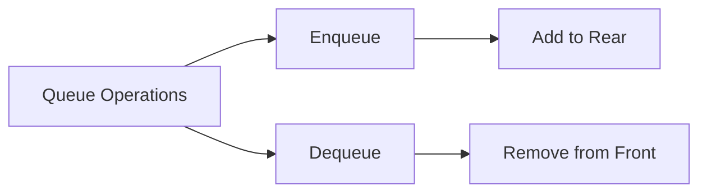

This diagram illustrates the Enqueue and Dequeue operations on a queue.

### પ્રશ્ન 2(બOR): ક્યુ ઉપર એનક્યુ ડીક્યુ ઓપરેશન સમજાવો. (૦૪)

**જવાબ 2(બOR):**

ક્યુ એ એક linear data structure છે જે First-In-First-Out (FIFO) સિદ્ધાંતને અનુસરે છે. ક્યુ પરના બે મુખ્ય ઓપરેશન્સ એનક્યુ અને ડીક્યુ છે.

1. **એનક્યુ (Enqueue) ઓપરેશન:**
   - ક્યુના પાછળના ભાગમાં એક element ઉમેરે છે
   - ક્યુનું કદ 1 વધારે છે
   - જો ક્યુ ભરેલી હોય, તો તે queue overflow સ્થિતિમાં પરિણમે છે

   ```python
   def enqueue(queue, item):
       if len(queue) < MAX_SIZE:
           queue.append(item)
       else:
           print("ક્યુ ઓવરફ્લો")
   ```

2. **ડીક્યુ (Dequeue) ઓપરેશન:**
   - ક્યુના આગળના ભાગમાંથી element દૂર કરે છે
   - ક્યુનું કદ 1 ઘટાડે છે
   - જો ક્યુ ખાલી હોય, તો તે queue underflow સ્થિતિમાં પરિણમે છે

   ```python
   def dequeue(queue):
       if not is_empty(queue):
           return queue.pop(0)
       else:
           print("ક્યુ અંડરફ્લો")
           return None
   ```

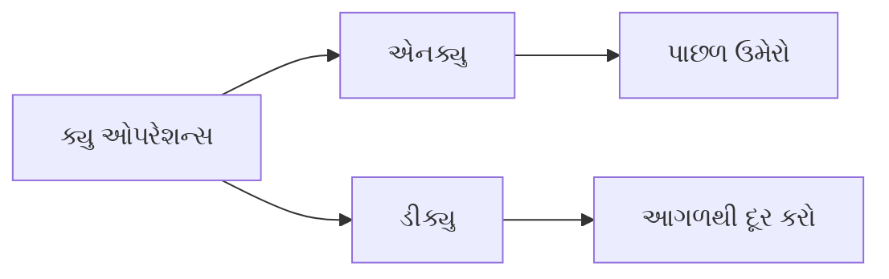

આ આકૃતિ ક્યુ પરના એનક્યુ અને ડીક્યુ ઓપરેશન્સને દર્શાવે છે.

### Question 2(cOR): Convert expression A+B/C+D to postfix and evaluate postfix expression using stack assuming some values for A, B, C and D. (07 marks)

**Ans 2(cOR):**

Let's break this down into two parts: converting the infix expression to postfix, and then evaluating the postfix expression.

1. Converting A+B/C+D to postfix:

Step 1: Use the following precedence rules:
- '+' and '-' have lower precedence
- '*' and '/' have higher precedence
- Left to right associativity for operators with equal precedence

Step 2: Scan the infix expression from left to right:
A → output: A
+ → push to stack: +
B → output: AB
/ → push to stack: /+
C → output: ABC
+ → pop and output /, pop and output +, push +
D → output: ABC/+D

Step 3: Pop remaining operators from the stack:
Final postfix expression: ABC/+D+

2. Evaluating the postfix expression:

Let's assume the following values:
A = 5, B = 10, C = 2, D = 3

We'll use a stack to evaluate the postfix expression:

```python
def evaluate_postfix(expression, values):
    stack = []
    for char in expression:
        if char in values:
            stack.append(values[char])
        else:
            b = stack.pop()
            a = stack.pop()
            if char == '+':
                stack.append(a + b)
            elif char == '/':
                stack.append(a / b)
    return stack.pop()

values = {'A': 5, 'B': 10, 'C': 2, 'D': 3}
postfix = "ABC/+D+"
result = evaluate_postfix(postfix, values)
print(f"Result: {result}")
```

Evaluation steps:
1. Push 5 (A)
2. Push 10 (B)
3. Push 2 (C)
4. Pop 2, Pop 10, Divide: 10/2 = 5, Push 5
5. Pop 5, Pop 5, Add: 5+5 = 10, Push 10
6. Push 3 (D)
7. Pop 3, Pop 10, Add: 10+3 = 13

Final result: 13

```mermaid
graph TD
    A[Start] --> B[Convert to Postfix]
    B --> C[ABC/+D+]
    C --> D[Evaluate Postfix]
    D --> E[Push 5 A]
    E --> F[Push 10 B]
    F --> G[Push 2 C]
    G --> H[Divide B/C]
    H --> I[Add A + B/C]
    I --> J[Push 3 D]
    J --> K[Add Result + D]
    K --> L[Final Result: 13]
```

### પ્રશ્ન 2(કOR): A+B/C+D પદ ને પોસ્ટફીક્ષ મા ફેરવો અને સ્ટેક નો ઉપયોગ કરીને A,B,C અને D ની કોઇ કિમત ધારીને એનુ મુલ્ય શોધો. (૦૭)

**જવાબ 2(કOR):**

આ પ્રશ્નને બે ભાગમાં વિભાજિત કરીએ: ઇનફિક્સ અભિવ્યક્તિને પોસ્ટફિક્સમાં રૂપાંતરિત કરવી અને પછી પોસ્ટફિક્સ અભિવ્યક્તિનું મૂલ્યાંકન કરવું.

1. A+B/C+D ને પોસ્ટફિક્સમાં રૂપાંતરિત કરવું:

પગલું 1: નીચેના પ્રાધાન્યતા નિયમોનો ઉપયોગ કરો:
- '+' અને '-' ને ઓછી પ્રાધાન્યતા
- '*' અને '/' ને ઉચ્ચ પ્રાધાન્યતા
- સમાન પ્રાધાન્યતા વાળા ઓપરેટર્સ માટે ડાબેથી જમણે સંકલન

પગલું 2: ઇનફિક્સ અભિવ્યક્તિને ડાબેથી જમણે સ્કેન કરો:
A → આઉટપુટ: A
+ → સ્ટેકમાં પુશ કરો: +
B → આઉટપુટ: AB
/ → સ્ટેકમાં પુશ કરો: /+
C → આઉટપુટ: ABC
+ → પોપ કરો અને / આઉટપુટ કરો, પોપ કરો અને + આઉટપુટ કરો, + પુશ કરો
D → આઉટપુટ: ABC/+D

પગલું 3: સ્ટેકમાંથી બાકીના ઓપરેટર્સને પોપ કરો:
અંતિમ પોસ્ટફિક્સ અભિવ્યક્તિ: ABC/+D+

2. પોસ્ટફિક્સ અભિવ્યક્તિનું મૂલ્યાંકન:

ચાલો નીચેની કિંમતો ધારીએ:
A = 5, B = 10, C = 2, D = 3

આપણે પોસ્ટફિક્સ અભિવ્યક્તિનું મૂલ્યાંકન કરવા માટે સ્ટેકનો ઉપયોગ કરીશું:

```python
def evaluate_postfix(expression, values):
    stack = []
    for char in expression:
        if char in values:
            stack.append(values[char])
        else:
            b = stack.pop()
            a = stack.pop()
            if char == '+':
                stack.append(a + b)
            elif char == '/':
                stack.append(a / b)
    return stack.pop()

values = {'A': 5, 'B': 10, 'C': 2, 'D': 3}
postfix = "ABC/+D+"
result = evaluate_postfix(postfix, values)
print(f"પરિણામ: {result}")
```

મૂલ્યાંકન પગલાં:
1. 5 પુશ કરો (A)
2. 10 પુશ કરો (B)
3. 2 પુશ કરો (C)
4. 2 પોપ કરો, 10 પોપ કરો, ભાગાકાર: 10/2 = 5, 5 પુશ કરો
5. 5 પોપ કરો, 5 પોપ કરો, સરવાળો: 5+5 = 10, 10 પુશ કરો
6. 3 પુશ કરો (D)
7. 3 પોપ કરો, 10 પોપ કરો, સરવાળો: 10+3 = 13

અંતિમ પરિણામ: 13

```mermaid
graph TD
    A[શરૂઆત] --> B[પોસ્ટફિક્સમાં રૂપાંતર]
    B --> C[ABC/+D+]
    C --> D[પોસ્ટફિક્સનું મૂલ્યાંકન]
    D --> E[5 પુશ કરો A]
    E --> F[10 પુશ કરો B]
    F --> G[2 પુશ કરો C]
    G --> H[B/C ભાગાકાર]
    H --> I[A + B/C સરવાળો]
    I --> J[3 પુશ કરો D]
    J --> K[પરિણામ + D સરવાળો]
    K --> L[અંતિમ પરિણામ: 13]
```

### Question 3(a): Enlist applications of Linked List. (03 marks)

**Ans 3(a):**
Linked Lists are versatile data structures with numerous applications in computer science and software development. Here are some key applications of Linked Lists:

1. **Dynamic Memory Allocation:**
   - Used in memory management systems for efficient allocation and deallocation of memory blocks.

2. **Implementation of Other Data Structures:**
   - Serves as a building block for more complex data structures like:
     - Stacks
     - Queues
     - Hash tables (for handling collisions)

3. **Undo Functionality in Applications:**
   - Maintains a history of operations in software applications, enabling undo/redo features.

4. **Symbol Table Management in Compiler Design:**
   - Stores and manages symbol information during the compilation process.

5. **Polynomial Arithmetic:**
   - Represents and manipulates polynomials in mathematical software.

6. **Image Viewer Applications:**
   - Implements image galleries with efficient navigation between images.

7. **Music Player Playlists:**
   - Manages and navigates through song lists in media players.

8. **Browser History:**
   - Implements forward and backward navigation in web browsers.

```mermaid
graph TD
    A[Linked List Applications] --> B[Dynamic Memory Allocation]
    A --> C[Implementation of Other Data Structures]
    A --> D[Undo Functionality]
    A --> E[Symbol Table Management]
    A --> F[Polynomial Arithmetic]
    A --> G[Image Viewer Applications]
    A --> H[Music Player Playlists]
    A --> I[Browser History]
```

This diagram illustrates the various applications of Linked Lists across different domains in computer science and software development.

### પ્રશ્ન 3(અ): લિંક્ડ લિસ્ટ ના ઉપયોગો લખો. (૦૩)

**જવાબ 3(અ):**
લિંક્ડ લિસ્ટ્સ એ કમ્પ્યુટર સાયન્સ અને સોફ્ટવેર ડેવલપમેન્ટમાં અનેક ઉપયોગો ધરાવતા બહુમુખી ડેટા સ્ટ્રક્ચર્સ છે. અહીં લિંક્ડ લિસ્ટ્સના કેટલાક મુખ્ય ઉપયોગો આપેલા છે:

1. **ડાયનેમિક મેમરી એલોકેશન:**
   - મેમરી બ્લોક્સના કાર્યક્ષમ એલોકેશન અને ડિએલોકેશન માટે મેમરી મેનેજમેન્ટ સિસ્ટમ્સમાં ઉપયોગમાં લેવાય છે.

2. **અન્ય ડેટા સ્ટ્રક્ચર્સનું અમલીકરણ:**
   - વધુ જટિલ ડેટા સ્ટ્રક્ચર્સ માટે બિલ્ડિંગ બ્લોક તરીકે સેવા આપે છે, જેમ કે:
     - સ્ટેક્સ
     - ક્યૂઝ
     - હેશ ટેબલ્સ (કોલિઝન્સ હેન્ડલ કરવા માટે)

3. **એપ્લિકેશન્સમાં અનડુ ફંક્શનાલિટી:**
   - સોફ્ટવેર એપ્લિકેશન્સમાં ઓપરેશન્સનો ઇતિહાસ જાળવે છે, જે અનડુ/રીડુ સુવિધાઓને સક્ષમ કરે છે.

4. **કમ્પાઇલર ડિઝાઇનમાં સિમ્બોલ ટેબલ મેનેજમેન્ટ:**
   - કમ્પાઇલેશન પ્રક્રિયા દરમિયાન સિમ્બોલ માહિતીને સંગ્રહિત અને સંચાલિત કરે છે.

5. **પોલિનોમિયલ અંકગણિત:**
   - ગણિતશાસ્ત્ર સોફ્ટવેરમાં પોલિનોમિયલ્સનું પ્રતિનિધિત્વ અને અમલીકરણ કરે છે.

6. **ઇમેજ વ્યૂઅર એપ્લિકેશન્સ:**
   - ઇમેજ ગેલેરીઓને કાર્યક્ષમ નેવિગેશન સાથે અમલમાં મૂકે છે.

7. **મ્યુઝિક પ્લેયર પ્લેલિસ્ટ્સ:**
   - મીડિયા પ્લેયર્સમાં ગીતોની યાદીઓનું સંચાલન અને નેવિગેશન કરે છે.

8. **બ્રાઉઝર હિસ્ટ્રી:**
   - વેબ બ્રાઉઝર્સમાં આગળ અને પાછળ નેવિગેશનનો અમલ કરે છે.

```mermaid
graph TD
    A[લિંક્ડ લિસ્ટ ઉપયોગો] --> B[ડાયનેમિક મેમરી એલોકેશન]
    A --> C[અન્ય ડેટા સ્ટ્રક્ચર્સનું અમલીકરણ]
    A --> D[અનડુ ફંક્શનાલિટી]
    A --> E[સિમ્બોલ ટેબલ મેનેજમેન્ટ]
    A --> F[પોલિનોમિયલ અંકગણિત]
    A --> G[ઇમેજ વ્યૂઅર એપ્લિકેશન્સ]
    A --> H[મ્યુઝિક પ્લેયર પ્લેલિસ્ટ્સ]
    A --> I[બ્રાઉઝર હિસ્ટ્રી]
```

આ આકૃતિ કમ્પ્યુટર સાયન્સ અને સોફ્ટવેર ડેવલપમેન્ટના વિવિધ ક્ષેત્રોમાં લિંક્ડ લિસ્ટ્સના વિવિધ ઉપયોગોને દર્શાવે છે.

### Question 3(b): Explain creation of singly linked list in Python. (04 marks)

**Ans 3(b):**
Creating a singly linked list in Python involves defining two main components: a Node class and a LinkedList class. Here's a step-by-step explanation:

1. Define the Node class:
   ```python
   class Node:
       def __init__(self, data):
           self.data = data
           self.next = None
   ```
   This class represents individual nodes in the list, containing data and a reference to the next node.

2. Define the LinkedList class:
   ```python
   class LinkedList:
       def __init__(self):
           self.head = None
   ```
   This class represents the linked list itself, with a head pointer to the first node.

3. Implement methods to add nodes:
   ```python
   def append(self, data):
       new_node = Node(data)
       if not self.head:
           self.head = new_node
           return
       current = self.head
       while current.next:
           current = current.next
       current.next = new_node
   ```
   This method adds a new node to the end of the list.

4. Implement a method to display the list:
   ```python
   def display(self):
       current = self.head
       while current:
           print(current.data, end=" -> ")
           current = current.next
       print("None")
   ```
   This method prints the contents of the list.

Example usage:
```python
# Create a linked list
my_list = LinkedList()

# Add elements
my_list.append(1)
my_list.append(2)
my_list.append(3)

# Display the list
my_list.display()  # Output: 1 -> 2 -> 3 -> None
```

```mermaid
graph LR
    A[Head] --> B[Node 1]
    B --> C[Node 2]
    C --> D[Node 3]
    D --> E[None]
    B --data--> F[1]
    C --data--> G[2]
    D --data--> H[3]
```

This diagram illustrates the structure of the created singly linked list.

### પ્રશ્ન 3(બ): પાયથનમા સિંગ્લી લિંક્ડ લિસ્ટ કેવી રીતે બનાવી શકાય એ સમજાવો. (૦૪)

**જવાબ 3(બ):**
પાયથનમાં સિંગ્લી લિંક્ડ લિસ્ટ બનાવવા માટે બે મુખ્ય ઘટકો વ્યાખ્યાયિત કરવાની જરૂર પડે છે: Node ક્લાસ અને LinkedList ક્લાસ. અહીં પગલાવાર સમજૂતી આપી છે:

1. Node ક્લાસ વ્યાખ્યાયિત કરો:
   ```python
   class Node:
       def __init__(self, data):
           self.data = data
           self.next = None
   ```
   આ ક્લાસ લિસ્ટમાં વ્યક્તિગત નોડ્સનું પ્રતિનિધિત્વ કરે છે, જેમાં ડેટા અને આગળના નોડનો સંદર્ભ હોય છે.

2. LinkedList ક્લાસ વ્યાખ્યાયિત કરો:
   ```python
   class LinkedList:
       def __init__(self):
           self.head = None
   ```
   આ ક્લાસ લિંક્ડ લિસ્ટ પોતેનું પ્રતિનિધિત્વ કરે છે, જેમાં પ્રથમ નોડ તરફ પોઇન્ટ કરતું head પોઇન્ટર હોય છે.

3. નોડ્સ ઉમેરવા માટેની પદ્ધતિઓ અમલમાં મૂકો:
   ```python
   def append(self, data):
       new_node = Node(data)
       if not self.head:
           self.head = new_node
           return
       current = self.head
       while current.next:
           current = current.next
       current.next = new_node
   ```
   આ પદ્ધતિ લિસ્ટના અંતે નવો નોડ ઉમેરે છે.

4. લિસ્ટ પ્રદર્શિત કરવા માટેની પદ્ધતિ અમલમાં મૂકો:
   ```python
   def display(self):
       current = self.head
       while current:
           print(current.data, end=" -> ")
           current = current.next
       print("None")
   ```
   આ પદ્ધતિ લિસ્ટની સામગ્રી પ્રિન્ટ કરે છે.

ઉપયોગનું ઉદાહરણ:
```python
# લિંક્ડ લિસ્ટ બનાવો
my_list = LinkedList()

# તત્વો ઉમેરો
my_list.append(1)
my_list.append(2)
my_list.append(3)

# લિસ્ટ પ્રદર્શિત કરો
my_list.display()  # આઉટપુટ: 1 -> 2 -> 3 -> None
```

```mermaid
graph LR
    A[Head] --> B[Node 1]
    B --> C[Node 2]
    C --> D[Node 3]
    D --> E[None]
    B --data--> F[1]
    C --data--> G[2]
    D --data--> H[3]
```

આ આકૃતિ બનાવેલ સિંગ્લી લિંક્ડ લિસ્ટની રચનાને દર્શાવે છે.

### Question 3(c): Write a code to insert a new node at the beginning and end of singly linked list. (07 marks)

**Ans 3(c):**
Let's create a Python implementation of a singly linked list with methods to insert nodes at the beginning and end of the list.

```python
class Node:
    def __init__(self, data):
        self.data = data
        self.next = None

class LinkedList:
    def __init__(self):
        self.head = None

    def insert_at_beginning(self, data):
        new_node = Node(data)
        new_node.next = self.head
        self.head = new_node

    def insert_at_end(self, data):
        new_node = Node(data)
        if not self.head:
            self.head = new_node
            return
        current = self.head
        while current.next:
            current = current.next
        current.next = new_node

    def display(self):
        current = self.head
        while current:
            print(current.data, end=" -> ")
            current = current.next
        print("None")

# Example usage
linked_list = LinkedList()

# Insert at the beginning
linked_list.insert_at_beginning(3)
linked_list.insert_at_beginning(2)
linked_list.insert_at_beginning(1)

print("After inserting at the beginning:")
linked_list.display()

# Insert at the end
linked_list.insert_at_end(4)
linked_list.insert_at_end(5)

print("After inserting at the end:")
linked_list.display()
```

Explanation:

1. `Node` class: Represents a single node in the linked list.

2. `LinkedList` class: Represents the entire linked list.

3. `insert_at_beginning` method:
   - Creates a new node
   - Sets the new node's next pointer to the current head
   - Updates the head to point to the new node

4. `insert_at_end` method:
   - Creates a new node
   - If the list is empty, sets the head to the new node
   - Otherwise, traverses to the end of the list and adds the new node

5. `display` method: Prints the entire list.

Output:
```
After inserting at the beginning:
1 -> 2 -> 3 -> None
After inserting at the end:
1 -> 2 -> 3 -> 4 -> 5 -> None
```

```mermaid
graph LR
    A[Head] --> B[1]
    B --> C[2]
    C --> D[3]
    D --> E[4]
    E --> F[5]
    F --> G[None]
```

This diagram illustrates the final state of the linked list after insertions at both the beginning and end.

### પ્રશ્ન 3(ક): સિંગ્લી લિંક્ડ લિસ્ટ ની શરૂઆતમાં અને અંતમાં નવા નોડ ઉમેરવાનો કોડ લખો. (૦૭)

**જવાબ 3(ક):**
ચાલો સિંગ્લી લિંક્ડ લિસ્ટનું પાયથન અમલીકરણ બનાવીએ જેમાં લિસ્ટની શરૂઆત અને અંતમાં નોડ્સ ઉમેરવાની પદ્ધતિઓ હોય.

```python
class Node:
    def __init__(self, data):
        self.data = data
        self.next = None

class LinkedList:
    def __init__(self):
        self.head = None

    def insert_at_beginning(self, data):
        new_node = Node(data)
        new_node.next = self.head
        self.head = new_node

    def insert_at_end(self, data):
        new_node = Node(data)
        if not self.head:
            self.head = new_node
            return
        current = self.head
        while current.next:
            current = current.next
        current.next = new_node

    def display(self):
        current = self.head
        while current:
            print(current.data, end=" -> ")
            current = current.next
        print("None")

# ઉપયોગનું ઉદાહરણ
linked_list = LinkedList()

# શરૂઆતમાં ઉમેરો
linked_list.insert_at_beginning(3)
linked_list.insert_at_beginning(2)
linked_list.insert_at_beginning(1)

print("શરૂઆતમાં ઉમેર્યા પછી:")
linked_list.display()

# અંતમાં ઉમેરો
linked_list.insert_at_end(4)
linked_list.insert_at_end(5)

print("અંતમાં ઉમેર્યા પછી:")
linked_list.display()
```

સમજૂતી:

1. `Node` ક્લાસ: લિંક્ડ લિસ્ટમાં એક નોડનું પ્રતિનિધિત્વ કરે છે.

2. `LinkedList` ક્લાસ: સમગ્ર લિંક્ડ લિસ્ટનું પ્રતિનિધિત્વ કરે છે.

3. `insert_at_beginning` પદ્ધતિ:
   - નવો નોડ બનાવે છે
   - નવા નોડના next પોઇન્ટરને વર્તમાન head પર સેટ કરે છે
   - head ને અપડેટ કરીને નવા નોડ તરફ પોઇન્ટ કરાવે છે

4. `insert_at_end` પદ્ધતિ:
   - નવો નોડ બનાવે છે
   - જો લિસ્ટ ખાલી હોય, તો head ને નવા નોડ પર સેટ કરે છે
   - અન્યથા, લિસ્ટના અંત સુધી જાય છે અને નવો નોડ ઉમેરે છે

5. `display` પદ્ધતિ: સમગ્ર લિસ્ટને પ્રિન્ટ કરે છે.

આઉટપુટ:
```
શરૂઆતમાં ઉમેર્યા પછી:
1 -> 2 -> 3 -> None
અંતમાં ઉમેર્યા પછી:
1 -> 2 -> 3 -> 4 -> 5 -> None
```

```mermaid
graph LR
    A[Head] --> B[1]
    B --> C[2]
    C --> D[3]
    D --> E[4]
    E --> F[5]
    F --> G[None]
```

આ આકૃતિ શરૂઆત અને અંત બંને પર ઉમેરણી પછી લિંક્ડ લિસ્ટની અંતિમ સ્થિતિને દર્શાવે છે.

### Question 3(aOR): Write a code to count the number of nodes in singly linked list. (03 marks)

**Ans 3(aOR):**
Here's a Python implementation to count the number of nodes in a singly linked list:

```python
class Node:
    def __init__(self, data):
        self.data = data
        self.next = None

class LinkedList:
    def __init__(self):
        self.head = None

    def count_nodes(self):
        count = 0
        current = self.head
        while current:
            count += 1
            current = current.next
        return count

# Example usage
linked_list = LinkedList()
linked_list.head = Node(1)
linked_list.head.next = Node(2)
linked_list.head.next.next = Node(3)

print("Number of nodes:", linked_list.count_nodes())
```

Explanation:
1. We define a `Node` class to represent individual nodes.
2. The `LinkedList` class has a `count_nodes` method that:
   - Initializes a counter to 0.
   - Traverses the list from the head.
   - Increments the counter for each node.
   - Returns the final count.

Output:
```
Number of nodes: 3
```

### પ્રશ્ન 3(અOR): સિંગ્લી લિંક્ડ મા રહેલ નોડ ની સંખ્યા ગણવા માટેનો કોડ લખો. (૦૩)

**જવાબ 3(અOR):**
અહીં સિંગ્લી લિંક્ડ લિસ્ટમાં નોડની સંખ્યા ગણવા માટેનું પાયથન અમલીકરણ આપેલું છે:

```python
class Node:
    def __init__(self, data):
        self.data = data
        self.next = None

class LinkedList:
    def __init__(self):
        self.head = None

    def count_nodes(self):
        count = 0
        current = self.head
        while current:
            count += 1
            current = current.next
        return count

# ઉપયોગનું ઉદાહરણ
linked_list = LinkedList()
linked_list.head = Node(1)
linked_list.head.next = Node(2)
linked_list.head.next.next = Node(3)

print("નોડની સંખ્યા:", linked_list.count_nodes())
```

સમજૂતી:
1. આપણે વ્યક્તિગત નોડ્સનું પ્રતિનિધિત્વ કરવા માટે `Node` ક્લાસ વ્યાખ્યાયિત કરીએ છીએ.
2. `LinkedList` ક્લાસમાં `count_nodes` પદ્ધતિ છે જે:
   - કાઉન્ટરને 0થી શરૂ કરે છે.
   - હેડથી શરૂ કરીને લિસ્ટને ટ્રાવર્સ કરે છે.
   - દરેક નોડ માટે કાઉન્ટરને વધારે છે.
   - અંતિમ ગણતરી પરત કરે છે.

આઉટપુટ:
```
નોડની સંખ્યા: 3
```

Here are the correct matches for both the English and Gujarati versions of the question:

### Question 3(bOR): Match appropriate options from column A and B (04 marks)

| Column A                 | Column B                                                     |
| ------------------------ | ------------------------------------------------------------ |
| 1. Singly Linked List    | a. Basic unit containing data and references                 |
| 2. Doubly Linked List    | b. Nodes form a loop where the last node points to the first node |
| 3. Circular Linked List  | c. Nodes contain data and a reference to the next node       |
| 4. Node in a Linked List | d. Nodes contain data and references to both the next and previous nodes |

**Ans 3(bOR):**

1. Singly Linked List    - c. Nodes contain data and a reference to the next node
2. Doubly Linked List    - d. Nodes contain data and references to both the next and previous nodes
3. Circular Linked List  - b. Nodes form a loop where the last node points to the first node
4. Node in a Linked List - a. Basic unit containing data and references

### પ્રશ્ન 3(બOR): કોલમ એ અને કોલમ બી ના યોગ્ય વિકલ્પ જોડો. (૦૪)

| કોલમ એ                 | કોલમ બી                                                |
| ---------------------- | ------------------------------------------------------ |
| 1. સિંગ્લી લિંક્ડ લિસ્ટ     | a. મુળભુત એકમ કે જેમા ડેટા અને સંદર્ભ હોય.                     |
| 2. ડબ્લી લિંક્ડ લિસ્ટ      | b. નોડ્સ એક લૂપ બનાવે જેમા છેલ્લો નોડ પ્રથમ નોડ તરફ નિર્દેશ કરે. |
| 3. સર્ક્યુલર લિંક્ડ લિસ્ટ    | c. નોડ્સમાં ડેટા અને આગામી નોડનો સંદર્ભ હોય છે                |
| 4. લિંક્ડ લિસ્ટ નો એક નોડ | d. નોડ્સમાં આગામી અને પાછલા બંને નોડ્સનો ડેટા અને સંદર્ભો હોય છે  |

**જવાબ 3(bOR):**

1. સિંગ્લી લિંક્ડ લિસ્ટ     - c. નોડ્સમાં ડેટા અને આગામી નોડનો સંદર્ભ હોય છે
2. ડબ્લી લિંક્ડ લિસ્ટ      - d. નોડ્સમાં આગામી અને પાછલા બંને નોડ્સનો ડેટા અને સંદર્ભો હોય છે
3. સર્ક્યુલર લિંક્ડ લિસ્ટ    - b. નોડ્સ એક લૂપ બનાવે જેમા છેલ્લો નોડ પ્રથમ નોડ તરફ નિર્દેશ કરે.
4. લિંક્ડ લિસ્ટ નો એક નોડ - a. મુળભુત એકમ કે જેમા ડેટા અને સંદર્ભ હોય.

These matches correctly associate each type of linked list or component with its defining characteristic.

### Q3cOR: Explain the deletion of the first and last node in the singly linked list. (**07 marks**)
**Answer Q3cOR:**

In a singly linked list, deleting the first and last nodes requires different approaches due to the list's structure. Let's examine both cases:

1. Deleting the First Node:
   - Set a temporary pointer to the current head.
   - Move the head to point to the second node (head.next).
   - Delete the temporary pointer to free memory.

   ```python
   def delete_first_node(self):
       if self.head:
           temp = self.head
           self.head = self.head.next
           del temp
   ```

2. Deleting the Last Node:
   - If the list is empty or has only one node, set head to None.
   - Otherwise, traverse the list until the second-to-last node.
   - Set the next of the second-to-last node to None.
   - Delete the last node to free memory.

   ```python
   def delete_last_node(self):
       if not self.head:
           return
       if not self.head.next:
           del self.head
           self.head = None
           return
       current = self.head
       while current.next.next:
           current = current.next
       del current.next
       current.next = None
   ```

Key points:
- Deleting the first node is O(1) time complexity.
- Deleting the last node is O(n) time complexity, where n is the number of nodes.
- Always handle edge cases like empty lists or lists with only one node.
- Proper memory management is crucial to avoid memory leaks.

```mermaid
graph TD
    A[Delete Node] --> B{First or Last?}
    B -->|First| C[Set temp to head]
    C --> D[Move head to next node]
    D --> E[Delete temp]
    B -->|Last| F{Empty list?}
    F -->|Yes| G[Return]
    F -->|No| H{Only one node?}
    H -->|Yes| I[Delete head, set to None]
    H -->|No| J[Traverse to second-to-last]
    J --> K[Set next to None]
    K --> L[Delete last node]
```

This diagram illustrates the decision process and steps involved in deleting the first and last nodes of a singly linked list.

________________
### Q3cOR: સિંગ્લી લિંક્ડ લિસ્ટ મા પ્રથમ અને છેલ્લો નોડ ને કાઢી નાખવાનુ સમજાવો. (**૦૭**)

**જવાબ Q3cOR:**

સિંગ્લી લિંક્ડ લિસ્ટમાં પ્રથમ અને છેલ્લા નોડને કાઢી નાખવા માટે અલગ-અલગ પદ્ધતિઓની જરૂર પડે છે. ચાલો બંને કેસ જોઈએ:

1. પ્રથમ નોડ કાઢી નાખવો:
   - વર્તમાન head માટે એક અસ્થાયી પોઈન્ટર સેટ કરો.
   - head ને બીજા નોડ (head.next) પર પોઈન્ટ કરાવો.
   - મેમરી મુક્ત કરવા માટે અસ્થાયી પોઈન્ટરને કાઢી નાખો.

   ```python
   def delete_first_node(self):
       if self.head:
           temp = self.head
           self.head = self.head.next
           del temp
   ```

2. છેલ્લો નોડ કાઢી નાખવો:
   - જો લિસ્ટ ખાલી હોય અથવા માત્ર એક નોડ હોય, તો head ને None સેટ કરો.
   - અન્યથા, છેલ્લાથી બીજા નોડ સુધી લિસ્ટને ટ્રેવર્સ કરો.
   - છેલ્લાથી બીજા નોડના next ને None સેટ કરો.
   - મેમરી મુક્ત કરવા માટે છેલ્લા નોડને કાઢી નાખો.

   ```python
   def delete_last_node(self):
       if not self.head:
           return
       if not self.head.next:
           del self.head
           self.head = None
           return
       current = self.head
       while current.next.next:
           current = current.next
       del current.next
       current.next = None
   ```

મુખ્ય મુદ્દાઓ:
- પ્રથમ નોડ કાઢી નાખવાની સમય જટિલતા O(1) છે.
- છેલ્લો નોડ કાઢી નાખવાની સમય જટિલતા O(n) છે, જ્યાં n નોડ્સની સંખ્યા છે.
- ખાલી લિસ્ટ અથવા માત્ર એક નોડવાળી લિસ્ટ જેવા કિસ્સાઓને હંમેશા સંભાળવા જોઈએ.
- મેમરી લીક ટાળવા માટે યોગ્ય મેમરી મેનેજમેન્ટ મહત્વપૂર્ણ છે.

```mermaid
graph TD
    A[નોડ કાઢી નાખો] --> B{પ્રથમ કે છેલ્લો?}
    B -->|પ્રથમ| C[temp ને head પર સેટ કરો]
    C --> D[head ને આગળના નોડ પર ખસેડો]
    D --> E[temp ને કાઢી નાખો]
    B -->|છેલ્લો| F{લિસ્ટ ખાલી છે?}
    F -->|હા| G[પાછા ફરો]
    F -->|ના| H{માત્ર એક નોડ છે?}
    H -->|હા| I[head કાઢી નાખો, None સેટ કરો]
    H -->|ના| J[છેલ્લાથી બીજા સુધી જાઓ]
    J --> K[next ને None સેટ કરો]
    K --> L[છેલ્લો નોડ કાઢી નાખો]
```

આ આકૃતિ સિંગ્લી લિંક્ડ લિસ્ટમાં પ્રથમ અને છેલ્લા નોડને કાઢી નાખવાની પ્રક્રિયા અને પગલાંઓને દર્શાવે છે.

### Q4a: Explain concept of doubly linked list. (03 marks)

A doubly linked list is a type of linear data structure where each node contains three components:
1. Data: Stores the actual value.
2. Next pointer: Points to the next node in the sequence.
3. Previous pointer: Points to the previous node in the sequence.

Key features:
- Bidirectional traversal: Can be traversed both forward and backward.
- Dynamic size: Can grow or shrink at runtime.
- Efficient insertion/deletion: O(1) time complexity at both ends.

Structure of a node in Python:
```python
class Node:
    def __init__(self, data):
        self.data = data
        self.next = None
        self.prev = None
```

Advantages:
- Easy reversal of list
- Efficient deletion of nodes
- Can be used to implement stacks and queues

Disadvantages:
- More memory usage due to extra pointer
- Slightly more complex implementation

```mermaid
graph LR
    A[Node 1] <--> B[Node 2]
    B <--> C[Node 3]
    C <--> D[...]
```

This diagram illustrates the bidirectional nature of a doubly linked list, showing how nodes are connected in both directions.

### Q4a: ડબ્લી લિંક્ડ લિસ્ટ નો કોંસેપ્ટ સમજાવો. (૦૩)

ડબલી લિંક્ડ લિસ્ટ એ એક પ્રકારનું લીનીયર ડેટા સ્ટ્રક્ચર છે જેમાં દરેક નોડમાં ત્રણ ઘટકો હોય છે:
1. ડેટા: વાસ્તવિક મૂલ્ય સંગ્રહિત કરે છે.
2. આગળનો પોઇન્ટર: ક્રમમાં આગળના નોડને નિર્દેશ કરે છે.
3. પાછળનો પોઇન્ટર: ક્રમમાં પાછલા નોડને નિર્દેશ કરે છે.

મુખ્ય લક્ષણો:
- દ્વિદિશ ટ્રાવર્સલ: આગળ અને પાછળ બંને દિશામાં ટ્રાવર્સ કરી શકાય છે.
- ડાયનેમિક સાઇઝ: રનટાઇમ પર વધી અથવા ઘટી શકે છે.
- કાર્યક્ષમ ઇન્સર્શન/ડિલીશન: બંને છેડે O(1) સમય જટિલતા.

પાયથોનમાં નોડની રચના:
```python
class Node:
    def __init__(self, data):
        self.data = data
        self.next = None
        self.prev = None
```

ફાયદાઓ:
- લિસ્ટને સરળતાથી ઉલટાવી શકાય છે
- નોડ્સનું કાર્યક્ષમ ડિલીશન
- સ્ટેક્સ અને ક્યૂઝ implement કરવા માટે વાપરી શકાય છે

ગેરફાયદાઓ:
- વધારાના પોઇન્ટરને કારણે વધુ મેમરી વપરાશ
- થોડું વધુ જટિલ અમલીકરણ

```mermaid
graph LR
    A[નોડ 1] <--> B[નોડ 2]
    B <--> C[નોડ 3]
    C <--> D[...]
```

આ આકૃતિ ડબલી લિંક્ડ લિસ્ટની દ્વિદિશ પ્રકૃતિને દર્શાવે છે, જે બતાવે છે કે નોડ્સ બંને દિશાઓમાં કેવી રીતે જોડાયેલા છે.

### Q4b: Explain concept of linear search. (04 marks)

Linear search, also known as sequential search, is a simple searching algorithm used to find a specific element in a list or array. Here's an explanation of the concept:

1. Working Principle:
   - The algorithm checks each element in the list sequentially.
   - It compares each element with the target value until a match is found or the end of the list is reached.

2. Algorithm Steps:
   - Start from the first element of the list.
   - Compare the current element with the target value.
   - If they match, return the index of the current element.
   - If not, move to the next element and repeat steps 2-3.
   - If the end of the list is reached without finding a match, return -1 or indicate the element is not found.

3. Time Complexity:
   - Best Case: O(1) - when the target is the first element.
   - Worst Case: O(n) - when the target is the last element or not in the list.
   - Average Case: O(n) - on average, half the elements are checked.

4. Implementation in Python:
   ```python
   def linear_search(arr, target):
       for i in range(len(arr)):
           if arr[i] == target:
               return i
       return -1
   ```

5. Advantages and Disadvantages:
   - Advantages: Simple to implement, works on unsorted lists.
   - Disadvantages: Inefficient for large datasets.

```mermaid
graph LR
    A[Start] --> B[Check Element]
    B --> C{Match?}
    C -->|Yes| D[Return Index]
    C -->|No| E{End of List?}
    E -->|No| F[Move to Next]
    F --> B
    E -->|Yes| G[Not Found]
```

This diagram illustrates the linear search process, showing the step-by-step flow of checking elements until a match is found or the end of the list is reached.

### Q4b: લિનિયર સર્ચ નો કોંસેપ્ટ સમજાવો. (૦૪)

લિનિયર સર્ચ, જેને સિક્વેન્શિયલ સર્ચ પણ કહેવાય છે, એ એક સરળ શોધ એલ્ગોરિધમ છે જે લિસ્ટ અથવા એરેમાં કોઈ ચોક્કસ તત્વને શોધવા માટે વપરાય છે. અહીં કોન્સેપ્ટની સમજૂતી આપી છે:

1. કાર્ય સિદ્ધાંત:
   - એલ્ગોરિધમ લિસ્ટમાં દરેક તત્વને ક્રમશઃ ચકાસે છે.
   - તે દરેક તત્વને લક્ષ્ય મૂલ્ય સાથે સરખાવે છે જ્યાં સુધી મેળ ન મળે અથવા લિસ્ટનો અંત ન આવે.

2. એલ્ગોરિધમના પગલાં:
   - લિસ્ટના પ્રથમ તત્વથી શરૂ કરો.
   - વર્તમાન તત્વને લક્ષ્ય મૂલ્ય સાથે સરખાવો.
   - જો તેઓ મેળ ખાય, તો વર્તમાન તત્વનો ઇન્ડેક્સ પરત કરો.
   - જો નહીં, તો આગળના તત્વ પર જાઓ અને પગલાં 2-3 પુનરાવર્તિત કરો.
   - જો મેળ મળ્યા વિના લિસ્ટનો અંત આવે, તો -1 પરત કરો અથવા તત્વ મળ્યું નથી એમ સૂચવો.

3. સમય જટિલતા:
   - શ્રેષ્ઠ કેસ: O(1) - જ્યારે લક્ષ્ય પ્રથમ તત્વ હોય.
   - સૌથી ખરાબ કેસ: O(n) - જ્યારે લક્ષ્ય છેલ્લું તત્વ હોય અથવા લિસ્ટમાં ન હોય.
   - સરેરાશ કેસ: O(n) - સરેરાશ રીતે, અડધા તત્વો ચકાસવામાં આવે છે.

4. પાયથોનમાં અમલીકરણ:
   ```python
   def linear_search(arr, target):
       for i in range(len(arr)):
           if arr[i] == target:
               return i
       return -1
   ```

5. ફાયદા અને ગેરફાયદા:
   - ફાયદા: અમલ કરવામાં સરળ, અવ્યવસ્થિત લિસ્ટ પર કામ કરે છે.
   - ગેરફાયદા: મોટા ડેટાસેટ માટે અકાર્યક્ષમ.

```mermaid
graph LR
    A[શરૂઆત] --> B[તત્વ ચકાસો]
    B --> C{મેળ?}
    C -->|હા| D[ઇન્ડેક્સ પરત કરો]
    C -->|ના| E{લિસ્ટનો અંત?}
    E -->|ના| F[આગળના પર જાઓ]
    F --> B
    E -->|હા| G[મળ્યું નથી]
```

આ આકૃતિ લિનિયર સર્ચની પ્રક્રિયાને દર્શાવે છે, જે મેળ મળે અથવા લિસ્ટનો અંત આવે ત્યાં સુધી તત્વોની તપાસનો પગલે પગલે પ્રવાહ બતાવે છે.

### Q4c: Write a code to implement binary search algorithm. (07 marks)

Binary search is an efficient algorithm for searching a sorted array by repeatedly dividing the search interval in half. Here's an implementation of the binary search algorithm in Python:

```python
def binary_search(arr, target):
    left = 0
    right = len(arr) - 1

    while left <= right:
        mid = (left + right) // 2
        
        if arr[mid] == target:
            return mid  # Target found, return its index
        elif arr[mid] < target:
            left = mid + 1  # Target is in the right half
        else:
            right = mid - 1  # Target is in the left half

    return -1  # Target not found in the array

# Example usage
sorted_array = [1, 3, 5, 7, 9, 11, 13, 15, 17]
target = 7
result = binary_search(sorted_array, target)

if result != -1:
    print(f"Element {target} found at index {result}")
else:
    print(f"Element {target} not found in the array")
```

Key points of the implementation:

1. The function takes a sorted array and a target value as input.
2. It initializes two pointers, `left` and `right`, to the start and end of the array.
3. In each iteration, it calculates the middle index `mid`.
4. It compares the middle element with the target:
   - If equal, the target is found.
   - If the target is greater, search the right half.
   - If the target is smaller, search the left half.
5. The process continues until the target is found or the search space is exhausted.
6. If the target is not found, it returns -1.

Time Complexity: O(log n), where n is the number of elements in the array.
Space Complexity: O(1) as it uses only a constant amount of extra space.

```mermaid
graph TD
    A[Start] --> B[Initialize pointers]
    B --> C{Search condition met?}
    C -->|Yes| D[Calculate mid]
    D --> E{Compare mid element}
    E -->|Equal| F[Return mid]
    E -->|Less than| G[Update left pointer]
    E -->|Greater than| H[Update right pointer]
    G --> C
    H --> C
    C -->|No| I[Return not found]
    F --> J[End]
    I --> J
```

This diagram illustrates the flow of the binary search algorithm, showing the decision process and how the search space is narrowed down in each iteration.

### Q4c: બાયનરી સર્ચ અલ્ગોરિધમ ઇમ્પ્લીમેંટ કરવા માટેનો કોડ લખો. (૦૭)

બાયનરી સર્ચ એ એક કાર્યક્ષમ અલ્ગોરિધમ છે જે સોર્ટેડ એરેમાં શોધ અંતરાલને વારંવાર અડધામાં વિભાજિત કરીને શોધે છે. અહીં પાયથોનમાં બાયનરી સર્ચ અલ્ગોરિધમનું અમલીકરણ આપ્યું છે:

```python
def binary_search(arr, target):
    left = 0
    right = len(arr) - 1

    while left <= right:
        mid = (left + right) // 2
        
        if arr[mid] == target:
            return mid  # લક્ષ્ય મળ્યું, તેનો ઇન્ડેક્સ પરત કરો
        elif arr[mid] < target:
            left = mid + 1  # લક્ષ્ય જમણી બાજુના અર્ધભાગમાં છે
        else:
            right = mid - 1  # લક્ષ્ય ડાબી બાજુના અર્ધભાગમાં છે

    return -1  # લક્ષ્ય એરેમાં મળ્યું નથી

# ઉપયોગનું ઉદાહરણ
sorted_array = [1, 3, 5, 7, 9, 11, 13, 15, 17]
target = 7
result = binary_search(sorted_array, target)

if result != -1:
    print(f"તત્વ {target} ઇન્ડેક્સ {result} પર મળ્યું")
else:
    print(f"તત્વ {target} એરેમાં મળ્યું નથી")
```

અમલીકરણના મુખ્ય મુદ્દાઓ:

1. ફંક્શન સોર્ટેડ એરે અને લક્ષ્ય મૂલ્યને ઇનપુટ તરીકે લે છે.
2. તે `left` અને `right` નામના બે પોઇન્ટર્સને એરેની શરૂઆત અને અંત પર આરંભ કરે છે.
3. દરેક પુનરાવર્તનમાં, તે મધ્ય ઇન્ડેક્સ `mid` ની ગણતરી કરે છે.
4. તે મધ્ય તત્વને લક્ષ્ય સાથે સરખાવે છે:
   - જો સમાન હોય, તો લક્ષ્ય મળી ગયું છે.
   - જો લક્ષ્ય મોટું હોય, તો જમણી બાજુના અર્ધભાગમાં શોધો.
   - જો લક્ષ્ય નાનું હોય, તો ડાબી બાજુના અર્ધભાગમાં શોધો.
5. લક્ષ્ય મળે અથવા શોધ અવકાશ સમાપ્ત થાય ત્યાં સુધી પ્રક્રિયા ચાલુ રહે છે.
6. જો લક્ષ્ય ન મળે, તો તે -1 પરત કરે છે.

સમય જટિલતા: O(log n), જ્યાં n એરેમાં તત્વોની સંખ્યા છે.
સ્પેસ જટિલતા: O(1) કારણ કે તે માત્ર સ્થિર જગ્યાનો ઉપયોગ કરે છે.

```mermaid
graph TD
    A[શરૂઆત] --> B[પોઇન્ટર્સ આરંભ કરો]
    B --> C{શોધ ચાલુ?}
    C -->|હા| D[mid ગણો]
    D --> E{mid ચકાસો}
    E -->|સમાન| F[mid આપો]
    E -->|નાનું| G[left અપડેટ કરો]
    E -->|મોટું| H[right અપડેટ કરો]
    G --> C
    H --> C
    C -->|ના| I[ના મળ્યું]
    F --> K[સમાપ્ત]
    I --> K
```

આ આકૃતિ બાયનરી સર્ચ અલ્ગોરિધમના પ્રવાહને દર્શાવે છે, જે નિર્ણય પ્રક્રિયા અને દરેક પુનરાવર્તનમાં શોધ અવકાશ કેવી રીતે સાંકડો થાય છે તે બતાવે છે.

### Q4aOR: Explain concept of selection sort algorithm. (03 marks)

Selection sort is a simple comparison-based sorting algorithm. The main concept behind selection sort is as follows:

1. Basic Idea:
   - The algorithm divides the input list into two parts: a sorted portion and an unsorted portion.
   - It repeatedly selects the smallest (or largest) element from the unsorted portion and moves it to the end of the sorted portion.

2. Algorithm Steps:
   - Find the minimum element in the unsorted array
   - Swap it with the first element of the unsorted part
   - Move the boundary of the sorted array one element to the right

3. Time Complexity:
   - Best Case: O(n^2)
   - Average Case: O(n^2)
   - Worst Case: O(n^2)

4. Space Complexity:
   - O(1) as it sorts in-place

5. Key Characteristics:
   - Simple implementation
   - Performs well on small lists
   - Inefficient on large lists
   - Unstable sort (may change the relative order of equal elements)

```mermaid
graph TD
    A[Start] --> B[Set minimum to first element]
    B --> C[Compare with next element]
    C --> D{Smaller?}
    D -->|Yes| E[Update minimum]
    D -->|No| F[Move to next element]
    E --> F
    F --> G{End of array?}
    G -->|No| C
    G -->|Yes| H[Swap minimum with first unsorted element]
    H --> I{Whole array sorted?}
    I -->|No| B
    I -->|Yes| J[End]
```

This diagram illustrates the process of selection sort, showing how the algorithm repeatedly finds the minimum element and places it in the sorted portion of the array.

### Q4aOR: સિલેક્શન સોર્ટ અલ્ગોરીધમ નો કોંસેપ્ટ સમજાવો. (૦૩)

સિલેક્શન સોર્ટ એક સરળ તુલના-આધારિત સોર્ટિંગ અલ્ગોરિધમ છે. સિલેક્શન સોર્ટની પાછળનો મુખ્ય વિચાર આ મુજબ છે:

1. મૂળભૂત વિચાર:
   - અલ્ગોરિધમ ઇનપુટ લિસ્ટને બે ભાગમાં વિભાજિત કરે છે: સોર્ટેડ ભાગ અને અનસોર્ટેડ ભાગ.
   - તે વારંવાર અનસોર્ટેડ ભાગમાંથી સૌથી નાના (અથવા મોટા) તત્વને પસંદ કરે છે અને તેને સોર્ટેડ ભાગના અંતે ખસેડે છે.

2. અલ્ગોરિધમના પગલાં:
   - અનસોર્ટેડ એરેમાં લઘુત્તમ તત્વ શોધો
   - તેને અનસોર્ટેડ ભાગના પ્રથમ તત્વ સાથે સ્વેપ કરો
   - સોર્ટેડ એરેની સીમાને એક તત્વ જમણી તરફ ખસેડો

3. સમય જટિલતા:
   - શ્રેષ્ઠ કેસ: O(n^2)
   - સરેરાશ કેસ: O(n^2)
   - સૌથી ખરાબ કેસ: O(n^2)

4. સ્પેસ જટિલતા:
   - O(1) કારણ કે તે ઇન-પ્લેસ સોર્ટ કરે છે

5. મુખ્ય લક્ષણો:
   - સરળ અમલીકરણ
   - નાની યાદીઓ પર સારું પ્રદર્શન કરે છે
   - મોટી યાદીઓ પર અકાર્યક્ષમ
   - અસ્થિર સોર્ટ (સમાન તત્વોનો સાપેક્ષ ક્રમ બદલી શકે છે)

```mermaid
graph TD
    A[શરૂઆત] --> B[પ્રથમ તત્વને ન્યૂનતમ તરીકે સેટ કરો]
    B --> C[આગળના તત્વ સાથે સરખાવો]
    C --> D{નાનું?}
    D -->|હા| E[ન્યૂનતમ અપડેટ કરો]
    D -->|ના| F[આગળના તત્વ પર જાઓ]
    E --> F
    F --> G{એરેનો અંત?}
    G -->|ના| C
    G -->|હા| H[ન્યૂનતમને પ્રથમ અનસોર્ટેડ તત્વ સાથે સ્વેપ કરો]
    H --> I{આખો એરે સોર્ટેડ?}
    I -->|ના| B
    I -->|હા| J[સમાપ્ત]
```

આ આકૃતિ સિલેક્શન સોર્ટની પ્રક્રિયાને દર્શાવે છે, જે બતાવે છે કે અલ્ગોરિધમ કેવી રીતે વારંવાર ન્યૂનતમ તત્વ શોધે છે અને તેને એરેના સોર્ટેડ ભાગમાં મૂકે છે.

### Q4bOR: Explain bubble sort method. (04 marks)

Bubble sort is a simple sorting algorithm that repeatedly steps through the list, compares adjacent elements and swaps them if they are in the wrong order. The pass through the list is repeated until the list is sorted. Here's a detailed explanation:

1. Working Principle:
   - The algorithm compares adjacent elements in the array.
   - If the first element is greater than the second, it swaps them.
   - This process continues for the entire array, causing larger elements to "bubble up" to the end of the list.

2. Algorithm Steps:
   - Start with the first element of the array.
   - Compare it with the next element.
   - If it's larger, swap them.
   - Move to the next pair of adjacent elements and repeat steps 2-3.
   - After each pass, the largest unsorted element moves to its correct position at the end.
   - Repeat the process for n-1 passes, where n is the number of elements.

3. Time Complexity:
   - Best Case: O(n) when the array is already sorted
   - Average and Worst Case: O(n^2)

4. Space Complexity: O(1) as it sorts in-place

5. Advantages and Disadvantages:
   - Advantages: Simple to understand and implement
   - Disadvantages: Inefficient for large datasets

6. Optimization:
   - Can be optimized by stopping the algorithm if no swaps occur in a pass

```mermaid
graph TD
    A[Start] --> B[Outer loop]
    B --> C[Inner loop]
    C --> D{Compare adjacent elements}
    D -->|Greater| E[Swap elements]
    D -->|Not Greater| F[Move to next pair]
    E --> F
    F --> G{Inner loop complete?}
    G -->|No| C
    G -->|Yes| H{Outer loop complete?}
    H -->|No| B
    H -->|Yes| I[End]
```

This diagram illustrates the nested loop structure of the bubble sort algorithm, showing how elements are compared and swapped in each pass.

### Q4bOR: બબલ સોર્ટ મેથડ સમજાવો. (૦૪)

બબલ સોર્ટ એક સરળ સોર્ટિંગ અલ્ગોરિધમ છે જે વારંવાર યાદીમાંથી પસાર થાય છે, બાજુના તત્વોની તુલના કરે છે અને જો તેઓ ખોટા ક્રમમાં હોય તો તેમને સ્વેપ કરે છે. યાદી સોર્ટ થાય ત્યાં સુધી યાદીમાંથી પસાર થવાનું પુનરાવર્તન થાય છે. અહીં વિગતવાર સમજૂતી આપી છે:

1. કાર્ય સિદ્ધાંત:
   - અલ્ગોરિધમ એરેમાં બાજુના તત્વોની તુલના કરે છે.
   - જો પ્રથમ તત્વ બીજા કરતાં મોટું હોય, તો તે તેમને સ્વેપ કરે છે.
   - આ પ્રક્રિયા આખા એરે માટે ચાલુ રહે છે, જેના કારણે મોટા તત્વો યાદીના અંત તરફ "બબલ અપ" થાય છે.

2. અલ્ગોરિધમના પગલાં:
   - એરેના પ્રથમ તત્વથી શરૂ કરો.
   - તેને આગળના તત્વ સાથે સરખાવો.
   - જો તે મોટું હોય, તો તેમને સ્વેપ કરો.
   - બાજુના તત્વોની આગળની જોડી પર જાઓ અને પગલાં 2-3 પુનરાવર્તિત કરો.
   - દરેક પાસ પછી, સૌથી મોટું અનસોર્ટેડ તત્વ અંતે તેના સાચા સ્થાને ખસે છે.
   - n-1 પાસ માટે પ્રક્રિયાનું પુનરાવર્તન કરો, જ્યાં n તત્વોની સંખ્યા છે.

3. સમય જટિલતા:
   - શ્રેષ્ઠ કેસ: O(n) જ્યારે એરે પહેલેથી જ સોર્ટેડ હોય
   - સરેરાશ અને સૌથી ખરાબ કેસ: O(n^2)

4. સ્પેસ જટિલતા: O(1) કારણ કે તે ઇન-પ્લેસ સોર્ટ કરે છે

5. ફાયદા અને ગેરફાયદા:
   - ફાયદા: સમજવામાં અને અમલ કરવામાં સરળ
   - ગેરફાયદા: મોટા ડેટાસેટ્સ માટે અકાર્યક્ષમ

6. ઓપ્ટિમાઇઝેશન:
   - જો કોઈ પાસમાં કોઈ સ્વેપ ન થાય તો અલ્ગોરિધમને રોકીને ઓપ્ટિમાઇઝ કરી શકાય છે

```mermaid
graph TD
    A[શરૂઆત] --> B[બાહ્ય લૂપ]
    B --> C[આંતરિક લૂપ]
    C --> D{બાજુના તત્વોની તુલના}
    D -->|મોટું| E[તત્વો સ્વેપ કરો]
    D -->|નાનું/સમાન| F[આગળની જોડી]
    E --> F
    F --> G{આંતરિક લૂપ પૂર્ણ?}
    G -->|ના| C
    G -->|હા| H{બાહ્ય લૂપ પૂર્ણ?}
    H -->|ના| B
    H -->|હા| I[સમાપ્ત]
```

આ આકૃતિ બબલ સોર્ટ અલ્ગોરિધમની નેસ્ટેડ લૂપ સ્ટ્રક્ચરને દર્શાવે છે, જે બતાવે છે કે દરેક પાસમાં તત્વોની કેવી રીતે તુલના કરવામાં આવે છે અને સ્વેપ કરવામાં આવે છે.

### Q4cOR: Explain the working of quick sort method with example. (07 marks)

Quick sort is an efficient, divide-and-conquer sorting algorithm. Here's an explanation of its working with an example:

1. Basic Principle:
   - Choose a 'pivot' element from the array.
   - Partition the other elements into two sub-arrays, according to whether they are less than or greater than the pivot.
   - Recursively sort the sub-arrays.

2. Algorithm Steps:
   a. Select a pivot (usually the last element).
   b. Partition the array:
      - Move elements smaller than the pivot to the left.
      - Move elements larger than the pivot to the right.
   c. Recursively apply the above steps to the sub-arrays.

3. Example:
   Let's sort the array: [8, 3, 2, 5, 1, 7, 6, 4]

   Step 1: Choose last element (4) as pivot
   [8, 3, 2, 5, 1, 7, 6, 4]
                          ^
   Step 2: Partition
   [3, 2, 1, 4, 8, 7, 6, 5]
            ^
   Step 3: Recursively sort left and right sub-arrays
   Left: [3, 2, 1]   Right: [8, 7, 6, 5]

   Continuing this process:
   [1, 2, 3, 4, 5, 6, 7, 8]

4. Time Complexity:
   - Average case: O(n log n)
   - Worst case: O(n^2) (rare, occurs when the pivot is always the smallest or largest element)

5. Space Complexity: O(log n) due to the recursive call stack

6. Advantages:
   - Generally faster in practice compared to other O(n log n) algorithms
   - In-place sorting (doesn't require much additional memory)

```mermaid
graph TD
    A[Start] --> B[Choose Pivot]
    B --> C[Partition Array]
    C --> D{Left sub-array exists?}
    D -->|Yes| E[Recursively sort left]
    D -->|No| F{Right sub-array exists?}
    E --> F
    F -->|Yes| G[Recursively sort right]
    F -->|No| H[Combine sorted sub-arrays]
    G --> H
    H --> I[End]
```

This diagram illustrates the recursive nature of the quick sort algorithm, showing how the array is partitioned and sub-arrays are sorted.

### Q4cOR: ઉદાહરણ સાથે ક્વીક સોર્ટ મેથડનુ વર્કિંગ સમજાવો. (૦૭)

ક્વીક સોર્ટ એક કાર્યક્ષમ, વિભાજન-અને-શાસન સોર્ટિંગ અલ્ગોરિધમ છે. અહીં ઉદાહરણ સાથે તેના કાર્યની સમજૂતી આપી છે:

1. મૂળભૂત સિદ્ધાંત:
   - એરેમાંથી એક 'પિવોટ' તત્વ પસંદ કરો.
   - અન્ય તત્વોને બે પેટા-એરેમાં વિભાજિત કરો, તેઓ પિવોટ કરતાં નાના છે કે મોટા તે મુજબ.
   - પેટા-એરેને પુનરાવર્તિત રીતે સોર્ટ કરો.

2. અલ્ગોરિધમના પગલાં:
   a. પિવોટ પસંદ કરો (સામાન્ય રીતે છેલ્લું તત્વ).
   b. એરેને વિભાજિત કરો:
      - પિવોટ કરતાં નાના તત્વોને ડાબી બાજુ ખસેડો.
      - પિવોટ કરતાં મોટા તત્વોને જમણી બાજુ ખસેડો.
   c. ઉપરોક્ત પગલાંને પેટા-એરે પર પુનરાવર્તિત રીતે લાગુ કરો.

3. ઉદાહરણ:
   ચાલો આ એરેને સોર્ટ કરીએ: [8, 3, 2, 5, 1, 7, 6, 4]

   પગલું 1: છેલ્લા તત્વને (4) પિવોટ તરીકે પસંદ કરો
   [8, 3, 2, 5, 1, 7, 6, 4]
                          ^
   પગલું 2: વિભાજન કરો
   [3, 2, 1, 4, 8, 7, 6, 5]
            ^
   પગલું 3: ડાબા અને જમણા પેટા-એરેને પુનરાવર્તિત રીતે સોર્ટ કરો
   ડાબે: [3, 2, 1]   જમણે: [8, 7, 6, 5]

   આ પ્રક્રિયા ચાલુ રાખતાં:
   [1, 2, 3, 4, 5, 6, 7, 8]

4. સમય જટિલતા:
   - સરેરાશ કેસ: O(n log n)
   - સૌથી ખરાબ કેસ: O(n^2) (દુર્લભ, જ્યારે પિવોટ હંમેશા સૌથી નાનું અથવા સૌથી મોટું તત્વ હોય ત્યારે થાય છે)

5. સ્પેસ જટિલતા: O(log n) પુનરાવર્તિત કૉલ સ્ટેકને કારણે

6. ફાયદાઓ:
   - સામાન્ય રીતે અન્ય O(n log n) અલ્ગોરિધમ્સની તુલનામાં વ્યવહારમાં ઝડપી
   - ઇન-પ્લેસ સોર્ટિંગ (ઘણી વધારાની મેમરીની જરૂર પડતી નથી)

```mermaid
graph TD
    A[શરૂઆત] --> B[પિવોટ પસંદ કરો]
    B --> C[એરેને વિભાજિત કરો]
    C --> D{ડાબો પેટા-એરે છે?}
    D -->|હા| E[ડાબાને પુનરાવર્તિત સોર્ટ કરો]
    D -->|ના| F{જમણો પેટા-એરે છે?}
    E --> F
    F -->|હા| G[જમણાને પુનરાવર્તિત સોર્ટ કરો]
    F -->|ના| H[સોર્ટેડ પેટા-એરેને જોડો]
    G --> H
    H --> I[સમાપ્ત]
```

આ આકૃતિ ક્વીક સોર્ટ અલ્ગોરિધમની પુનરાવર્તિત પ્રકૃતિને દર્શાવે છે, જે બતાવે છે કે કેવી રીતે એરેને વિભાજિત કરવામાં આવે છે અને પેટા-એરેને સોર્ટ કરવામાં આવે છે.

### Q5a: Explain binary tree. (03 marks)

A binary tree is a hierarchical data structure in which each node has at most two children, referred to as the left child and the right child. Here are the key points about binary trees:

1. Structure:
   - Root: The topmost node of the tree.
   - Nodes: Each element in the tree, containing data and references to children.
   - Leaves: Nodes with no children.

2. Properties:
   - Each node has 0, 1, or 2 children.
   - Left child: The node on the left side.
   - Right child: The node on the right side.

3. Types:
   - Full Binary Tree: Every node has 0 or 2 children.
   - Complete Binary Tree: All levels are fully filled except possibly the last level, which is filled from left to right.
   - Perfect Binary Tree: All internal nodes have two children and all leaves are at the same level.

4. Applications:
   - Expression trees in compilers.
   - Huffman coding trees in data compression.
   - Binary Search Trees for efficient searching and sorting.

5. Traversal Methods:
   - Inorder: Left, Root, Right
   - Preorder: Root, Left, Right
   - Postorder: Left, Right, Root

```mermaid
graph TD
    A[Root] --> B[Left Child]
    A --> C[Right Child]
    B --> D[Left Grandchild]
    B --> E[Right Grandchild]
    C --> F[Left Grandchild]
    C --> G[Right Grandchild]
```

This diagram illustrates a simple binary tree structure, showing the root, left and right children, and grandchildren nodes.

### Q5a: બાયનરી ટ્રી સમજાવો. (૦૩)

બાયનરી ટ્રી એ એક હાયરાર્કિકલ ડેટા સ્ટ્રક્ચર છે જેમાં દરેક નોડને વધુમાં વધુ બે બાળકો હોય છે, જેને ડાબું બાળક અને જમણું બાળક કહેવાય છે. અહીં બાયનરી ટ્રી વિશેના મુખ્ય મુદ્દાઓ છે:

1. રચના:
   - રૂટ: ટ્રીનો સૌથી ઉપરનો નોડ.
   - નોડ્સ: ટ્રીમાં દરેક તત્વ, જેમાં ડેટા અને બાળકોના સંદર્ભો હોય છે.
   - પાંદડાં: બાળકો વગરના નોડ્સ.

2. ગુણધર્મો:
   - દરેક નોડને 0, 1, અથવા 2 બાળકો હોય છે.
   - ડાબું બાળક: ડાબી બાજુનો નોડ.
   - જમણું બાળક: જમણી બાજુનો નોડ.

3. પ્રકારો:
   - પૂર્ણ બાયનરી ટ્રી: દરેક નોડને 0 અથવા 2 બાળકો હોય છે.
   - સંપૂર્ણ બાયનરી ટ્રી: છેલ્લા સ્તર સિવાય બધા સ્તરો સંપૂર્ણ ભરેલા હોય છે, છેલ્લું સ્તર ડાબેથી જમણે ભરાય છે.
   - આદર્શ બાયનરી ટ્રી: બધા આંતરિક નોડ્સને બે બાળકો હોય છે અને બધા પાંદડાં એક જ સ્તરે હોય છે.

4. ઉપયોગો:
   - કમ્પાइલરોમાં એક્સપ્રેશન ટ્રીઓ.
   - ડેટા કમ્પ્રેશનમાં હફમેન કોડિંગ ટ્રીઓ.
   - કાર્યક્ષમ શોધ અને સોર્ટિંગ માટે બાયનરી સર્ચ ટ્રીઓ.

5. ટ્રાવર્સલ પદ્ધતિઓ:
   - ઇનઓર્ડર: ડાબું, રૂટ, જમણું
   - પ્રીઓર્ડર: રૂટ, ડાબું, જમણું
   - પોસ્ટઓર્ડર: ડાબું, જમણું, રૂટ

```mermaid
graph TD
    A[રૂટ] --> B[ડાબું બાળક]
    A --> C[જમણું બાળક]
    B --> D[ડાબું પૌત્ર]
    B --> E[જમણું પૌત્ર]
    C --> F[ડાબું પૌત્ર]
    C --> G[જમણું પૌત્ર]
```

આ આકૃતિ એક સરળ બાયનરી ટ્રી સ્ટ્રક્ચરને દર્શાવે છે, જેમાં રૂટ, ડાબા અને જમણા બાળકો, અને પૌત્ર નોડ્સ બતાવવામાં આવ્યા છે.

Certainly. I'll regenerate both the English and Gujarati answers with the improvements we discussed.

### Q5b: Define the terms root, path, parent and children with reference to tree. (04 marks)

In the context of tree data structures, these terms have specific meanings:

1. Root:
   - Definition: The topmost node in a tree structure.
   - Characteristics:
     * It has no parent.
     * All other nodes can be reached from the root.
   - Example: In a family tree, the oldest known ancestor would be the root.

2. Path:
   - Definition: A sequence of nodes and edges connecting a node with a descendant.
   - Characteristics:
     * Starts from one node and ends at another.
     * Each node in the path is connected by an edge to the next node.
   - Example: The sequence of nodes you traverse to get from the root to a specific leaf.

3. Parent:
   - Definition: A node that has one or more child nodes.
   - Characteristics:
     * Directly connected to its children.
     * A node can be a parent to multiple children but can have only one parent (except the root).
   - Example: In a directory structure, a folder containing files is a parent to those files.

4. Children:
   - Definition: Nodes that are direct descendants of a parent node.
   - Characteristics:
     * Directly connected to their parent.
     * A node can have multiple children or no children (leaf).
   - Example: In an organizational chart, employees directly under a manager are the children nodes of that manager node.

```mermaid
graph TD
    A[Root] --> B[Child 1]
    A --> C[Child 2]
    B --> D[Grandchild 1]
    B --> E[Grandchild 2]
    C --> F[Grandchild 3]
```

This diagram illustrates the concepts of root (A), parent (A, B, C), children (B, C, D, E, F), and path (e.g., A -> B -> E). Here, A is the root, B and C are children of A, and D, E, F are grandchildren. The path from A to E is A -> B -> E.

### Q5b: ટ્રી ના સંદર્ભ મા રૂટ, પાથ, parent અને children પદો વ્યાખ્યાયિત કરો. (૦૪)

ટ્રી ડેટા સ્ટ્રક્ચરના સંદર્ભમાં, આ પદોના ચોક્કસ અર્થ છે:

1. રૂટ (Root):
   - વ્યાખ્યા: ટ્રી સ્ટ્રક્ચરમાં સૌથી ઉપરનો નોડ.
   - લક્ષણો:
     * તેને કોઈ parent નથી.
     * બધા અન્ય નોડ્સ રૂટથી પહોંચી શકાય છે.
   - ઉદાહરણ: કુટુંબ વૃક્ષમાં, સૌથી જૂનો જાણીતો પૂર્વજ રૂટ હશે.

2. પાથ (Path):
   - વ્યાખ્યા: એક નોડને તેના વંશજ સાથે જોડતા નોડ્સ અને એજની શ્રેણી.
   - લક્ષણો:
     * એક નોડથી શરૂ થાય છે અને બીજા પર સમાપ્ત થાય છે.
     * પાથમાં દરેક નોડ આગળના નોડ સાથે એજ દ્વારા જોડાયેલો હોય છે.
   - ઉદાહરણ: રૂટથી ચોક્કસ leaf સુધી પહોંચવા માટે તમે જે નોડ્સની શ્રેણીમાંથી પસાર થાઓ છો તે.

3. Parent:
   - વ્યાખ્યા: એક અથવા વધુ child નોડ્સ ધરાવતો નોડ.
   - લક્ષણો:
     * તેના children સાથે સીધો જોડાયેલો.
     * એક નોડ અનેક childrenનો parent હોઈ શકે છે પરંતુ તેને માત્ર એક જ parent હોઈ શકે છે (રૂટ સિવાય).
   - ઉદાહરણ: ડિરેક્ટરી સ્ટ્રક્ચરમાં, ફાઇલો ધરાવતું ફોલ્ડર તે ફાઇલોનો parent છે.

4. Children:
   - વ્યાખ્યા: parent નોડના સીધા વંશજો.
   - લક્ષણો:
     * તેમના parent સાથે સીધા જોડાયેલા.
     * એક નોડને અનેક children હોઈ શકે છે અથવા કોઈ child ન પણ હોય (leaf).
   - ઉદાહરણ: સંગઠનાત્મક ચાર્ટમાં, મેનેજર હેઠળ સીધા કર્મચારીઓ તે મેનેજર નોડના children નોડ્સ છે.

```mermaid
graph TD
    A[Root] --> B[Child 1]
    A --> C[Child 2]
    B --> D[Grandchild 1]
    B --> E[Grandchild 2]
    C --> F[Grandchild 3]
```

આ આકૃતિ રૂટ (A), parent (A, B, C), children (B, C, D, E, F), અને પાથ (દા.ત., A -> B -> E) ના ખ્યાલોને દર્શાવે છે. અહીં, A એ રૂટ છે, B અને C એ A ના children છે, અને D, E, F એ grandchildren છે. A થી E સુધીનો પાથ A -> B -> E છે.

### Q5c: Apply preorder and postorder traversal for given below tree. (07 marks)

```mermaid
graph TD
    Root["Root"] --> 40
    40((40)) --> 30((30))
    40 --> 50((50))
    30 --> 25((25))
    30 --> 35((35))
    50 --> 45((45))
    50 --> 60((60))
    25 --> 15((15))
    25 --> 28((28))
    60 --> 55((55))
    60 --> 70((70))
    
    classDef default fill:#D3D3D3,stroke:#000,stroke-width:1px;
    class Root font-weight:bold,fill:none,stroke:none;
    linkStyle default stroke:#000,stroke-width:1px;
```

Let's apply both preorder and postorder traversals to the given binary tree:

1. Preorder Traversal:
   - Algorithm: Visit Root, Traverse Left Subtree, Traverse Right Subtree
   - Steps:
     1. Visit the root (40)
     2. Traverse left subtree of 40
     3. Traverse right subtree of 40
   - Preorder sequence: 40, 30, 25, 15, 28, 35, 50, 45, 60, 55, 70

   Explanation:
   - Start at 40 (root)
   - Go left: 30, then 25, then 15
   - Backtrack to 25, go right: 28
   - Backtrack to 30, go right: 35
   - Backtrack to 40, go right: 50, then 45
   - Backtrack to 50, go right: 60, then 55
   - Backtrack to 60, go right: 70

2. Postorder Traversal:
   - Algorithm: Traverse Left Subtree, Traverse Right Subtree, Visit Root
   - Steps:
     1. Traverse left subtree of 40
     2. Traverse right subtree of 40
     3. Visit the root (40)
   - Postorder sequence: 15, 28, 25, 35, 30, 45, 55, 70, 60, 50, 40

   Explanation:
   - Start at leftmost leaf: 15
   - Go to its sibling: 28
   - Visit their parent: 25
   - Go to 25's sibling: 35
   - Visit their parent: 30
   - Move to right subtree, start at leftmost leaf: 45
   - Move to 60's left child: 55
   - Then to 60's right child: 70
   - Visit 60, then 50
   - Finally, visit the root: 40

```mermaid
graph TD
    Root["Root"] --> 40
    40((40)) --> 30((30))
    40 --> 50((50))
    30 --> 25((25))
    30 --> 35((35))
    50 --> 45((45))
    50 --> 60((60))
    25 --> 15((15))
    25 --> 28((28))
    60 --> 55((55))
    60 --> 70((70))
    
    classDef default fill:#D3D3D3,stroke:#000,stroke-width:1px;
    class Root font-weight:bold,fill:none,stroke:none;
    linkStyle default stroke:#000,stroke-width:1px;
```

This diagram shows the tree structure. The traversal orders given above demonstrate how preorder and postorder traversals navigate through this tree.

### Q5c: નીચે આપેલા ટ્રી માટે પ્રી ઓર્ડર અને પોસ્ટઓર્ડર ટ્રાવર્સલ લાગુ કરો. (૦૭)

```mermaid
graph TD
    Root["Root"] --> 40
    40((40)) --> 30((30))
    40 --> 50((50))
    30 --> 25((25))
    30 --> 35((35))
    50 --> 45((45))
    50 --> 60((60))
    25 --> 15((15))
    25 --> 28((28))
    60 --> 55((55))
    60 --> 70((70))
    
    classDef default fill:#D3D3D3,stroke:#000,stroke-width:1px;
    class Root font-weight:bold,fill:none,stroke:none;
    linkStyle default stroke:#000,stroke-width:1px;
```

આપેલા બાયનરી ટ્રી માટે પ્રી ઓર્ડર અને પોસ્ટઓર્ડર ટ્રાવર્સલ લાગુ કરીએ:

1. પ્રી ઓર્ડર ટ્રાવર્સલ:
   - અલ્ગોરિધમ: રૂટની મુલાકાત લો, ડાબા સબટ્રીને ટ્રાવર્સ કરો, જમણા સબટ્રીને ટ્રાવર્સ કરો
   - પગલાં:
     1. રૂટની મુલાકાત લો (40)
     2. 40ના ડાબા સબટ્રીને ટ્રાવર્સ કરો
     3. 40ના જમણા સબટ્રીને ટ્રાવર્સ કરો
   - પ્રી ઓર્ડર ક્રમ: 40, 30, 25, 15, 28, 35, 50, 45, 60, 55, 70

   સમજૂતી:
   - 40 (રૂટ)થી શરૂ કરો
   - ડાબે જાઓ: 30, પછી 25, પછી 15
   - 25 પર પાછા ફરો, જમણે જાઓ: 28
   - 30 પર પાછા ફરો, જમણે જાઓ: 35
   - 40 પર પાછા ફરો, જમણે જાઓ: 50, પછી 45
   - 50 પર પાછા ફરો, જમણે જાઓ: 60, પછી 55
   - 60 પર પાછા ફરો, જમણે જાઓ: 70

2. પોસ્ટઓર્ડર ટ્રાવર્સલ:
   - અલ્ગોરિધમ: ડાબા સબટ્રીને ટ્રાવર્સ કરો, જમણા સબટ્રીને ટ્રાવર્સ કરો, રૂટની મુલાકાત લો
   - પગલાં:
     1. 40ના ડાબા સબટ્રીને ટ્રાવર્સ કરો
     2. 40ના જમણા સબટ્રીને ટ્રાવર્સ કરો
     3. રૂટની મુલાકાત લો (40)
   - પોસ્ટઓર્ડર ક્રમ: 15, 28, 25, 35, 30, 45, 55, 70, 60, 50, 40

   સમજૂતી:
   - સૌથી ડાબા છેડાના leafથી શરૂ કરો: 15
   - તેના siblingમાં જાઓ: 28
   - તેમના parentની મુલાકાત લો: 25
   - 25ના siblingમાં જાઓ: 35
   - તેમના parentની મુલાકાત લો: 30
   - જમણા સબટ્રીમાં જાઓ, સૌથી ડાબા છેડાના leafથી શરૂ કરો: 45
   - 60ના ડાબા childમાં જાઓ: 55
   - પછી 60ના જમણા childમાં: 70
   - 60ની મુલાકાત લો, પછી 50
   - અંતે, રૂટની મુલાકાત લો: 40

```mermaid
graph TD
    Root["Root"] --> 40
    40((40)) --> 30((30))
    40 --> 50((50))
    30 --> 25((25))
    30 --> 35((35))
    50 --> 45((45))
    50 --> 60((60))
    25 --> 15((15))
    25 --> 28((28))
    60 --> 55((55))
    60 --> 70((70))
    
    classDef default fill:#D3D3D3,stroke:#000,stroke-width:1px;
    class Root font-weight:bold,fill:none,stroke:none;
    linkStyle default stroke:#000,stroke-width:1px;
```

આ આકૃતિ ટ્રી સ્ટ્રક્ચરને દર્શાવે છે. ઉપર આપેલા ટ્રાવર્સલ ક્રમો દર્શાવે છે કે પ્રી ઓર્ડર અને પોસ્ટઓર્ડર ટ્રાવર્સલ આ ટ્રીમાં કેવી રીતે નેવિગેટ કરે છે.

### Q5aOR: Enlist applications of binary tree. (03 marks)

Binary trees have numerous applications in computer science and real-world scenarios. Here are some key applications:

1. Expression Trees:
   - Used in compilers to represent and evaluate arithmetic expressions
   - Enables efficient parsing and calculation of mathematical formulas

2. Huffman Coding Trees:
   - Applied in data compression algorithms
   - Assigns variable-length codes to characters based on their frequency

3. Binary Search Trees (BST):
   - Efficient for searching, inserting, and deleting elements
   - Used in implementing database indexes and file systems

4. Decision Trees:
   - Applied in machine learning for classification and regression tasks
   - Used in artificial intelligence for game strategies

5. Syntax Trees:
   - Used in programming language compilers for parsing and code generation
   - Represents the structure of program code

6. Heap Data Structure:
   - Implements priority queues
   - Used in heap sort algorithm and graph algorithms like Dijkstra's shortest path

7. Trie (Prefix Tree):
   - Efficient for storing and searching strings
   - Used in autocomplete features and IP routing tables

These applications demonstrate the versatility and importance of binary trees in various areas of computer science and software development.

### Q5aOR: બાયનરી ટ્રી ની એપ્લિકેશંસ લખો. (૦૩)

બાયનરી ટ્રીના કમ્પ્યુટર સાયન્સ અને વાસ્તવિક દુનિયાના સ્થિતિઓમાં ઘણા ઉપયોગો છે. અહીં કેટલીક મુખ્ય એપ્લિકેશન્સ આપી છે:

1. Expression Trees:
   - કમ્પાઇલર્સમાં ગાણિતિક અભિવ્યક્તિઓને રજૂ કરવા અને મૂલ્યાંકન કરવા માટે વપરાય છે
   - ગાણિતિક સૂત્રોનું કાર્યક્ષમ parsing અને ગણતરી સક્ષમ કરે છે

2. Huffman Coding Trees:
   - ડેટા કમ્પ્રેશન અલ્ગોરિધમ્સમાં લાગુ કરવામાં આવે છે
   - અક્ષરોની આવૃત્તિના આધારે તેમને variable-length કોડ્સ આપે છે

3. Binary Search Trees (BST):
   - એલિમેન્ટ્સ શોધવા, દાખલ કરવા અને કાઢી નાખવા માટે કાર્યક્ષમ
   - ડેટાબેસ ઇન્ડેક્સ અને ફાઇલ સિસ્ટમ્સને અમલમાં મૂકવા માટે વપરાય છે

4. Decision Trees:
   - મશીન લર્નિંગમાં વર્ગીકરણ અને નિયમન કાર્યો માટે લાગુ કરવામાં આવે છે
   - ગેમ વ્યૂહરચનાઓ માટે આર્ટિફિશિયલ ઇન્ટેલિજન્સમાં વપરાય છે

5. Syntax Trees:
   - પ્રોગ્રામિંગ લેંગ્વેજ કમ્પાઇલર્સમાં parsing અને કોડ જનરેશન માટે વપરાય છે
   - પ્રોગ્રામ કોડની રચનાનું પ્રતિનિધિત્વ કરે છે

6. Heap Data Structure:
   - પ્રાયોરિટી ક્યૂઝને અમલમાં મૂકે છે
   - heap sort અલ્ગોરિધમ અને Dijkstra's shortest path જેવા ગ્રાફ અલ્ગોરિધમ્સમાં વપરાય છે

7. Trie (Prefix Tree):
   - સ્ટ્રિંગ્સ સ્ટોર કરવા અને શોધવા માટે કાર્યક્ષમ
   - ઓટોકમ્પ્લીટ સુવિધાઓ અને IP રાઉટિંગ ટેબલ્સમાં વપરાય છે

આ એપ્લિકેશન્સ કમ્પ્યુટર સાયન્સ અને સોફ્ટવેર ડેવલપમેન્ટના વિવિધ ક્ષેત્રોમાં બાયનરી ટ્રીની બહુમુખી પ્રતિભા અને મહત્વ દર્શાવે છે.

### Q5bOR: Explain insertion of a node in binary search tree. (04 marks)

Insertion of a node in a Binary Search Tree (BST) follows a specific algorithm to maintain the BST property. Here's a detailed explanation:

1. BST Property:
   - For any node, all elements in its left subtree are smaller than the node.
   - All elements in its right subtree are larger than the node.

2. Insertion Algorithm:
   a. Start at the root of the tree.
   b. Compare the new value with the current node:
      - If smaller, move to the left child.
      - If larger, move to the right child.
   c. Repeat step b until reaching a null pointer.
   d. Create a new node with the value and insert it at the null position.

3. Steps in Detail:
   - If the tree is empty, the new node becomes the root.
   - Otherwise, traverse the tree:
     * If the new value is less than the current node, go left.
     * If it's greater, go right.
     * If you reach a null pointer, insert the new node there.

4. Time Complexity:
   - Average case: O(log n), where n is the number of nodes.
   - Worst case (skewed tree): O(n)

```mermaid
graph TD
    A[Start at root] --> B{New value < current node?}
    B -->|Yes| C[Move to left child]
    B -->|No| D[Move to right child]
    C --> E{Left child exists?}
    D --> F{Right child exists?}
    E -->|Yes| B
    E -->|No| G[Insert new node as left child]
    F -->|Yes| B
    F -->|No| H[Insert new node as right child]
```

This flowchart illustrates the decision process for inserting a new node in a BST.

### Q5bOR: બાયનરી સર્ચ ટ્રી મા નોડ કેવી રીતે ઉમેરી શકાય તે સમજાવો. (૦૪)

બાયનરી સર્ચ ટ્રી (BST)માં નોડ ઉમેરવાની પ્રક્રિયા BST ગુણધર્મને જાળવવા માટે ચોક્કસ અલ્ગોરિધમનું પાલન કરે છે. અહીં વિગતવાર સમજૂતી આપી છે:

1. BST ગુણધર્મ:
   - કોઈપણ નોડ માટે, તેના ડાબા સબટ્રીમાં બધા તત્વો નોડ કરતાં નાના હોય છે.
   - તેના જમણા સબટ્રીમાં બધા તત્વો નોડ કરતાં મોટા હોય છે.

2. ઉમેરવાનો અલ્ગોરિધમ:
   a. ટ્રીના રૂટથી શરૂ કરો.
   b. નવા મૂલ્યને વર્તમાન નોડ સાથે સરખાવો:
      - જો નાનું હોય, તો ડાબા child પર જાઓ.
      - જો મોટું હોય, તો જમણા child પર જાઓ.
   c. null pointer સુધી પહોંચે ત્યાં સુધી પગલું b પુનરાવર્તિત કરો.
   d. મૂલ્ય સાથે નવો નોડ બનાવો અને તેને null સ્થાને દાખલ કરો.

3. વિગતવાર પગલાં:
   - જો ટ્રી ખાલી હોય, તો નવો નોડ રૂટ બને છે.
   - અન્યથા, ટ્રીને ટ્રાવર્સ કરો:
     * જો નવું મૂલ્ય વર્તમાન નોડ કરતાં ઓછું હોય, તો ડાબે જાઓ.
     * જો તે વધારે હોય, તો જમણે જાઓ.
     * જો તમે null pointer પર પહોંચો, તો ત્યાં નવો નોડ દાખલ કરો.

4. સમય જટિલતા:
   - સરેરાશ કેસ: O(log n), જ્યાં n નોડ્સની સંખ્યા છે.
   - સૌથી ખરાબ કેસ (skewed tree): O(n)

```mermaid
graph TD
    A[રૂટથી શરૂ કરો] --> B{નવું મૂલ્ય < વર્તમાન નોડ?}
    B -->|હા| C[ડાબા child પર જાઓ]
    B -->|ના| D[જમણા child પર જાઓ]
    C --> E{ડાબું child છે?}
    D --> F{જમણું child છે?}
    E -->|હા| B
    E -->|ના| G[નવા નોડને ડાબા child તરીકે દાખલ કરો]
    F -->|હા| B
    F -->|ના| H[નવા નોડને જમણા child તરીકે દાખલ કરો]
```

આ ફ્લોચાર્ટ BST માં નવો નોડ દાખલ કરવા માટેની નિર્ણય પ્રક્રિયાને દર્શાવે છે.

### Q5cOR: Draw Binary search tree for 8, 4, 12, 2, 6, 10, 14, 1, 3, 5 and write In-order traversal for the tree. (07 marks)

Let's construct the Binary Search Tree (BST) step by step and then perform an in-order traversal.

1. BST Construction:
   - Start with 8 as the root
   - Insert each number one by one according to BST rules

Here's the resulting BST:

```mermaid
graph TD
    8((8)) --> 4((4))
    8 --> 12((12))
    4 --> 2((2))
    4 --> 6((6))
    2 --> 1((1))
    2 --> 3((3))
    6 --> 5((5))
    12 --> 10((10))
    12 --> 14((14))

    classDef default fill:#f9f,stroke:#333,stroke-width:1px;
```

2. In-order Traversal:
   - Algorithm: Visit left subtree, visit root, visit right subtree
   - Process: 
     * Start at the root (8)
     * Traverse left subtree completely
     * Visit the root
     * Traverse right subtree completely

3. In-order Traversal Sequence:
   1, 2, 3, 4, 5, 6, 8, 10, 12, 14

Explanation of the traversal:
- Start at 8, go left to 4, then to 2, then to 1
- Visit 1, go back to 2, visit 2, go right to 3
- Visit 3, go back to 4, visit 4, go right to 6
- Go left to 5, visit 5, go back to 6, visit 6
- Go back to 8, visit 8
- Go right to 12, go left to 10, visit 10
- Go back to 12, visit 12, go right to 14, visit 14

This in-order traversal results in the numbers being visited in ascending order, which is a property of in-order traversal in a BST.

### Q5cOR: 8, 4, 12, 2, 6, 10, 14, 1, 3, 5 નમ્બર માટે બાયનરી સર્ચ ટ્રી દોરો અને ટ્રી માટે ઇન ઓર્ડર ટ્રાવર્સલ લખો. (૦૭)

ચાલો, પગલે પગલે બાયનરી સર્ચ ટ્રી (BST) બનાવીએ અને પછી ઇન-ઓર્ડર ટ્રાવર્સલ કરીએ.

1. BST નિર્માણ:
   - 8 ને રૂટ તરીકે શરૂ કરો
   - BST નિયમો અનુસાર દરેક નંબરને એક પછી એક દાખલ કરો

અહીં પરિણામી BST છે:

```mermaid
graph TD
    8((8)) --> 4((4))
    8 --> 12((12))
    4 --> 2((2))
    4 --> 6((6))
    2 --> 1((1))
    2 --> 3((3))
    6 --> 5((5))
    12 --> 10((10))
    12 --> 14((14))

    classDef default fill:#f9f,stroke:#333,stroke-width:1px;
```

2. ઇન-ઓર્ડર ટ્રાવર્સલ:
   - અલ્ગોરિધમ: ડાબા સબટ્રીની મુલાકાત લો, રૂટની મુલાકાત લો, જમણા સબટ્રીની મુલાકાત લો
   - પ્રક્રિયા:
     * રૂટ (8) થી શરૂ કરો
     * ડાબા સબટ્રીને સંપૂર્ણપણે ટ્રાવર્સ કરો
     * રૂટની મુલાકાત લો
     * જમણા સબટ્રીને સંપૂર્ણપણે ટ્રાવર્સ કરો

3. ઇન-ઓર્ડર ટ્રાવર્સલ ક્રમ:
   1, 2, 3, 4, 5, 6, 8, 10, 12, 14

ટ્રાવર્સલની સમજૂતી:
- 8 થી શરૂ કરો, ડાબે 4 પર જાઓ, પછી 2 પર, પછી 1 પર
- 1 ની મુલાકાત લો, 2 પર પાછા જાઓ, 2 ની મુલાકાત લો, જમણે 3 પર જાઓ
- 3 ની મુલાકાત લો, 4 પર પાછા જાઓ, 4 ની મુલાકાત લો, જમણે 6 પર જાઓ
- ડાબે 5 પર જાઓ, 5 ની મુલાકાત લો, 6 પર પાછા જાઓ, 6 ની મુલાકાત લો
- 8 પર પાછા જાઓ, 8 ની મુલાકાત લો
- જમણે 12 પર જાઓ, ડાબે 10 પર જાઓ, 10 ની મુલાકાત લો
- 12 પર પાછા જાઓ, 12 ની મુલાકાત લો, જમણે 14 પર જાઓ, 14 ની મુલાકાત લો

આ ઇન-ઓર્ડર ટ્રાવર્સલ પરિણામે નંબરોની મુલાકાત ચડતા ક્રમમાં લેવાય છે, જે BST માં ઇન-ઓર્ડર ટ્રાવર્સલની એક વિશેષતા છે.
