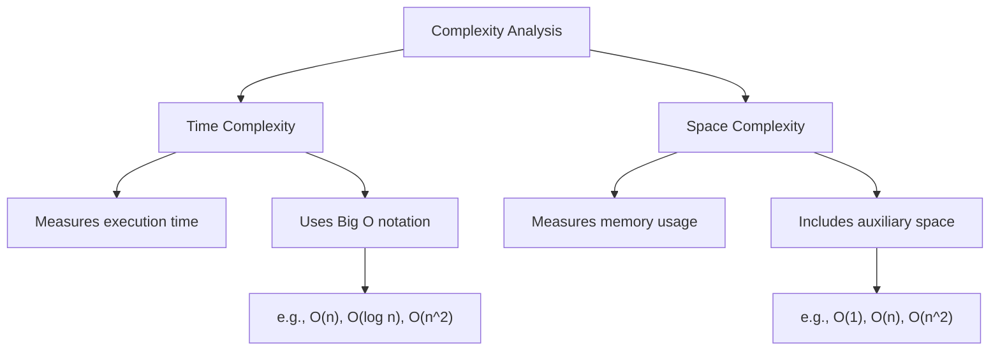
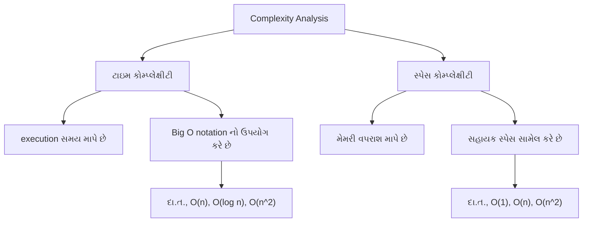
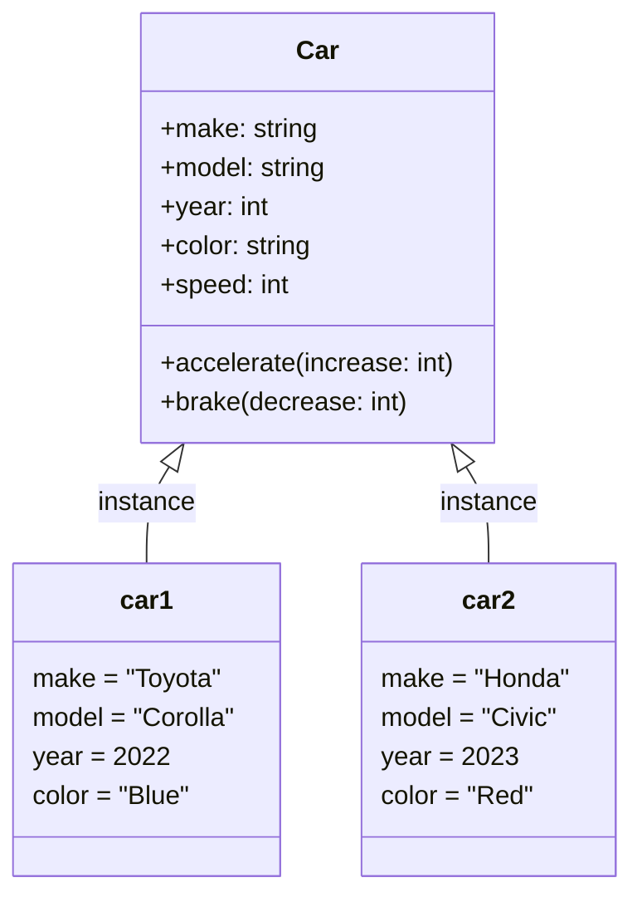

# DSA GTU Sols

## 1333203 DSA Summer 2024

### Question 1(a): Define linear data structure and give its examples. (03 marks)

**Ans 1(a):**
A linear data structure is a type of data organization where elements are arranged in a sequential manner, with each element directly linked to its adjacent elements. Key characteristics of linear data structures include:

- Elements are organized in a linear or sequential order.
- Each element has a unique predecessor and successor, except for the first and last elements.
- Data can be traversed in a single run, i.e., in one pass.

Examples of linear data structures:

1. **Array**: A collection of elements stored in contiguous memory locations.
2. **Linked List**: A sequence of nodes where each node contains data and a reference to the next node.
3. **Stack**: Follows Last-In-First-Out (LIFO) principle for element access.
4. **Queue**: Follows First-In-First-Out (FIFO) principle for element access.



### પ્રશ્ન 1(અ): રેખીય ડેટા સ્ટ્રક્ચર વ્યાખ્યાયિત કરો અને તેના ઉદાહરણો આપો. (૦૩)

**જવાબ 1(અ):**
રેખીય ડેટા સ્ટ્રક્ચર એ ડેટા સંગઠનનો એક પ્રકાર છે જ્યાં elements ક્રમિક રીતે ગોઠવાયેલા હોય છે, જેમાં દરેક element તેના આજુબાજુના elements સાથે સીધી રીતે જોડાયેલો હોય છે. રેખીય ડેટા સ્ટ્રક્ચરની મુખ્ય લાક્ષણિકતાઓમાં સામેલ છે:

- Elements રેખીય અથવા ક્રમિક ક્રમમાં ગોઠવાયેલા હોય છે.
- દરેક element ને અનન્ય પૂર્વગામી અને અનુગામી હોય છે, સિવાય કે પ્રથમ અને છેલ્લા elements.
- ડેટાને એક જ run માં, એટલે કે એક પાસમાં traverse કરી શકાય છે.

રેખીય ડેટા સ્ટ્રક્ચરના ઉદાહરણો:

1. **Array**: સળંગ મેમરી સ્થાનોમાં સંગ્રહિત elements નો સમૂહ.
2. **Linked List**: nodes નો ક્રમ જ્યાં દરેક node માં ડેટા અને આગળના node નો સંદર્ભ હોય છે.
3. **Stack**: Element access માટે Last-In-First-Out (LIFO) સિદ્ધાંતને અનુસરે છે.
4. **Queue**: Element access માટે First-In-First-Out (FIFO) સિદ્ધાંતને અનુસરે છે.

```mermaid
graph TD
    subgraph Array
    A[0] --> |10| B[1]
    B --> |20| C[2]
    C --> |30| D[3]
    D --> |40| E[4]
    end

    subgraph "Linked List"
    F["10 | ->"] --> G["20 | ->"]
    G --> H["30 | ->"]
    H --> I["40 | null"]
    end

    subgraph Stack
    J[Top] --> |40| K
    K --> |30| L
    L --> |20| M
    M --> |10| N[Bottom]
    end

    subgraph Queue
    O[Front] --> |10| P
    P --> |20| Q
    Q --> |30| R
    R --> |40| S[Rear]
    end
```


### Question 1(b): Define time and space complexity. (04 marks)

**Ans 1(b):**
Time and space complexity are crucial concepts in algorithm analysis that help evaluate the efficiency and resource requirements of an algorithm.

**Time Complexity:**
Time complexity is a measure of the amount of time an algorithm takes to complete as a function of the input size. It represents the number of operations or steps an algorithm performs relative to the input size.

Key points about time complexity:

- Expressed using Big O notation, e.g., O(n), O(log n), O(n^2)
- Focuses on the worst-case scenario
- Helps compare the efficiency of different algorithms
- Independent of hardware or implementation details

Example: An algorithm with O(n) time complexity means its execution time grows linearly with the input size.

**Space Complexity:**
Space complexity refers to the amount of memory space an algorithm requires relative to the input size. It measures how much additional or auxiliary space is needed by the algorithm to solve a problem.

Key points about space complexity:

- Also expressed using Big O notation
- Includes both auxiliary space and space used by the input
- Helps evaluate memory efficiency of algorithms
- Important for applications with limited memory resources

Example: An algorithm with O(1) space complexity uses a constant amount of extra space regardless of input size.



### પ્રશ્ન 1(બ): ટાઇમ અને સ્પેસ કોમ્પ્લેક્ષીટી વ્યાખ્યાયિત કરો. (૦૪)

**જવાબ 1(બ):**
ટાઇમ અને સ્પેસ કોમ્પ્લેક્ષીટી એ અલ્ગોરિધમ વિશ્લેષણમાં મહત્વપૂર્ણ ખ્યાલો છે જે અલ્ગોરિધમની કાર્યક્ષમતા અને સંસાધન જરૂરિયાતોનું મૂલ્યાંકન કરવામાં મદદ કરે છે.

**ટાઇમ કોમ્પ્લેક્ષીટી:**
ટાઇમ કોમ્પ્લેક્ષીટી એ ઇનપુટ સાઇઝના ફંક્શન તરીકે અલ્ગોરિધમ પૂર્ણ થવામાં લાગતા સમયનું માપ છે. તે ઇનપુટ સાઇઝના સંબંધમાં અલ્ગોરિધમ દ્વારા કરવામાં આવતા operations અથવા steps ની સંખ્યાને રજૂ કરે છે.

ટાઇમ કોમ્પ્લેક્ષીટી વિશેના મુખ્ય મુદ્દાઓ:

- Big O notation નો ઉપયોગ કરીને વ્યક્ત કરવામાં આવે છે, દા.ત., O(n), O(log n), O(n^2)
- સૌથી ખરાબ કેસ સ્થિતિ પર ધ્યાન કેન્દ્રિત કરે છે
- વિવિધ અલ્ગોરિધમ્સની કાર્યક્ષમતાની તુલના કરવામાં મદદ કરે છે
- હાર્ડવેર અથવા અમલીકરણની વિગતોથી સ્વતંત્ર

ઉદાહરણ: O(n) ટાઇમ કોમ્પ્લેક્ષીટી ધરાવતા અલ્ગોરિધમનો અર્થ એ છે કે તેનો execution સમય ઇનપુટ સાઇઝ સાથે રૈખિક રીતે વધે છે.

**સ્પેસ કોમ્પ્લેક્ષીટી:**
સ્પેસ કોમ્પ્લેક્ષીટી એ ઇનપુટ સાઇઝના સંબંધમાં અલ્ગોરિધમને જરૂરી મેમરી સ્પેસની રકમનો ઉલ્લેખ કરે છે. તે સમસ્યાનો ઉકેલ લાવવા માટે અલ્ગોરિધમને જરૂરી વધારાની અથવા સહાયક જગ્યાનું માપ કરે છે.

સ્પેસ કોમ્પ્લેક્ષીટી વિશેના મુખ્ય મુદ્દાઓ:

- પણ Big O notation નો ઉપયોગ કરીને વ્યક્ત કરવામાં આવે છે
- સહાયક સ્પેસ અને ઇનપુટ દ્વારા વપરાયેલ સ્પેસ બંને સામેલ છે
- અલ્ગોરિધમ્સની મેમરી કાર્યક્ષમતાનું મૂલ્યાંકન કરવામાં મદદ કરે છે
- મર્યાદિત મેમરી સંસાધનો ધરાવતા એપ્લિકેશનો માટે મહત્વપૂર્ણ

ઉદાહરણ: O(1) સ્પેસ કોમ્પ્લેક્ષીટી ધરાવતો અલ્ગોરિધમ ઇનપુટ સાઇઝને ધ્યાનમાં લીધા વિના સતત પ્રમાણમાં વધારાની જગ્યાનો ઉપયોગ કરે છે.



### Question 1(c): Explain the concept of class and object with example. (07 marks)

**Ans 1(c):**
Classes and objects are fundamental concepts in object-oriented programming (OOP). They provide a way to structure code, encapsulate data, and create reusable components.

**Class:**
A class is a blueprint or template for creating objects. It defines the attributes (data) and methods (functions) that the objects of that class will have.

Key points about classes:

- Act as a blueprint for objects
- Encapsulate data and behavior
- Support inheritance and polymorphism
- Promote code reusability and organization

**Object:**
An object is an instance of a class. It represents a specific entity with its own set of data and ability to perform actions defined by its class.

Key points about objects:

- Instances of a class
- Have their own unique set of attributes
- Can perform actions (methods) defined in their class
- Interact with other objects

**Example: Car Class and Objects**

Let's illustrate these concepts with a `Car` class and car objects:

```python
class Car:
    def __init__(self, make, model, year, color):
        self.make = make
        self.model = model
        self.year = year
        self.color = color
        self.speed = 0

    def accelerate(self, increase):
        self.speed += increase
        print(f"{self.make} {self.model} is now going {self.speed} km/h")

    def brake(self, decrease):
        if self.speed - decrease < 0:
            self.speed = 0
        else:
            self.speed -= decrease
        print(f"{self.make} {self.model} slowed down to {self.speed} km/h")

# Creating car objects
car1 = Car("Toyota", "Corolla", 2022, "Blue")
car2 = Car("Honda", "Civic", 2023, "Red")

# Using object methods
car1.accelerate(50)
car2.accelerate(60)
car1.brake(20)
car2.brake(30)
```

In this example:

1. The `Car` class defines the blueprint for car objects.
2. It has attributes like `make`, `model`, `year`, `color`, and `speed`.
3. It also has methods `accelerate()` and `brake()` to modify the car's speed.
4. We create two car objects, `car1` and `car2`, each with its own set of attributes.
5. We can call methods on these objects to change their state.



This diagram illustrates the relationship between the `Car` class and its objects, showing how each object is an instance of the class with its own unique set of attributes.